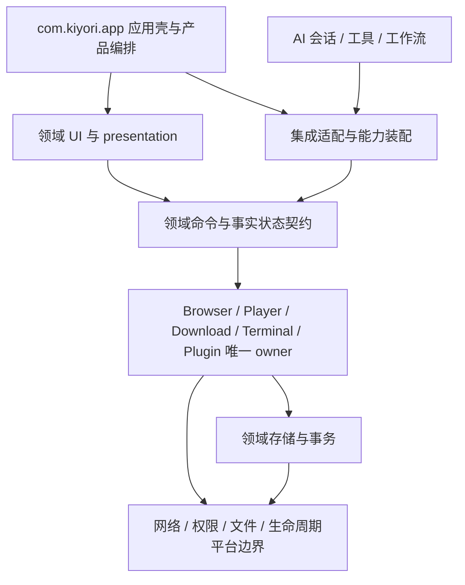

# 全项目重构 v4 设计与实施契约

本文件记录当前源码支持的设计、迁移及验证。进度只在 [总计划](index.md) 维护。
目标是保持全部现有功能与数据，消除真实耦合、重复状态、生命周期缺陷及不可复现输入。
不改变 ROM、产品流程、应用身份或离线能力，不以目录移动量、删除行数或主观比例验收。

## 证据范围与基线

基线为 2026-09-05 `main@65d12a65`，terminal 为 `7ec4cfb1`。9 个 Gradle 模块是
app、terminal、dragonbones、mnn、llama、mmd、fbx、showerclient、quickjs。
跟踪的 main Kotlin/Java 共 1521 文件，app 旧包根 1323、Kiyori 包根 64。
定向导入盘点仍有旧 `core -> ui` 35、`data -> core` 49、Kiyori app -> 旧 UI 68 条。
这些是方向定位线索，不把所有跨目录引用等同于缺陷。

本地正式准备、Debug 构建通过；Python 242 项通过；App JVM 基线 2025 项，2 失败、1
需要显式网络样本的 live-media 测试跳过。完整 Lint 用时 26m31s，报告新增 55 errors /
78 warnings / 1 hint，另有 20 条失效 baseline 项。架构检查有 20 个诊断，集中于后续新增组件、
变更的导航/主题消费者和失效例外。修复时审查其原保护目的，不能仅更新哈希换取通过。

基线 APK：483709823 bytes，SHA-256
`DD7E4327D0C3F969FC0B04E93D21B89BBA0E6B0571C0A3CB42E203F701C7EB2D`，
5514 ZIP 项、无重复名称、44 DEX、53 `.so` 加一个 shell ELF。身份 `com.kiyori`，
45/0.1.0，SDK 26/34/37，arm64-v8a，唯一 launcher 为稳定的旧 MainActivity。
Debug v2 签名及 16 KB ZIP 对齐已验证；完整 ELF/闭包复核纳入 E/F/G。

| 压缩后分类 | bytes | 约束 |
| --- | ---: | --- |
| models | 131675821 | 离线语音/推理输入，不能无消费者证据删除 |
| native | 98492694 | 按进程、ABI、DT_NEEDED、JNI 和动态加载路径分析 |
| DEX | 77406207 | Debug 口径；不能将 Release/R8 结果混作同口径提升 |
| generic assets | 72463994 | 含 Ubuntu rootfs；保留离线安装体验 |
| subpack | 36737593 | 预置 APK 有安装消费者，检查唯一输入 |
| packages | 27521807 | 按生产白名单及 ToolPkg 内容闭包检查 |

没有设备样本，冷/暖启动、TTID/TTFD、首次模块打开、内存/FD/线程、滚动、后台资源、终端
初始化均为待测。桌面编译耗时不作为应用性能。源码与 APK 私有备份及完整原始日志存于
仓库外；可复核摘要保留在此，私有检查点不纳入发布树。

## 目标边界及取舍

选择包级领域收束与内部 API 隔离先行。全量改 namespace 会同时触及 R/BuildConfig、JNI、
反射、Worker、序列化和 Android FQCN，无法用编译单独证明兼容；永久只改品牌又不能消除
实际所有权混乱。独立 Gradle 模块必须满足无依赖环、明确资源/依赖闭包、可独立测试或构建
收益三个条件。先治理构建任务边界，再决定模块粒度；不引入泛化总管理器或服务定位器。

图中 Cap 是领域已存在或按真实调用需求提取的接口集合，不是新建中央分发层。UI 只投影事实
与发命令；AI 使用同一能力入口及权限，不操作具体 Activity/Composable/ViewModel。
允许平台投影 Android 类型；不允许数据仓库依赖 UI 颜色/图形类型，不允许协议和市场 ID
规则定义在屏幕目录。JNI/AIDL/生态适配留在稳定入口，内部实现可迁入 Kiyori 自有领域。

目标目录沿用 `com.kiyori/{app,capability,design,feature,integration,platform}`，新增内容按
browser、download、player、files、workspace、extensions、ai 等实际职责落位。仅被一个域
消费的实现留在该域；不建立新的 `common/utils/manager` 堆积区。旧包根不是自动的兼容区：
每个保留项都需消费者依据，按域迁移后删除旧可执行路径。

### 运行时、数据与失败语义

主进程由 KiyoriApplication/AppShell 装配；Activity 兼容入口继续接收系统 Intent。
Browser Runtime 拥有 WebSession/WebView/配置、脚本和订阅，主线程负责 WebView 操作，IO
负责持久化与规则准备。应用级 owner 不随抽屉重建，页面只解除自己的回调/观察。
PlayerSession 拥有命令与 Surface generation，通过 PlayerRuntimeConnection 连接媒体进程；
Terminal 桥通过 AIDL 连接 TerminalService/TerminalManager，PTY 的完成帧是命令终态权威。
其他实际进程/组件按合并 Manifest 逐项核对，不因包迁移改变隔离。

启动保持首帧必要工作与可延迟初始化的现有区分；每个延迟项记录首次使用成本。全局 owner
只初始化一次，页面生命周期工作必须可取消。请求已提交、提交未知、失败、取消及用户重试
保留各协议真实语义，不能自动重交收费请求或把失败变成功。

持久化由原数据库、DataStore/偏好和存储路径唯一持有；本次首先避免 schema 变化。确需数据
迁移时，工作项必须先补版本、校验、原子提交、幂等和中断恢复测试；源码 bundle 不是运行
数据备份。外部接口适配只能显式委派，禁止双写、第二引擎或自动切换实现。

## 全域源码地图

下表路径相对于 `app/src/main/java`；旧根记为 `O=com/ai/assistance/operit`，新根记为
`K=com/kiyori`。表中“待审”是已定位的未知项，不能被解释成已完成深度审查。

| 领域 / 工作项 | 入口与事实 owner | 调用、数据、资源及待审边界 | 目标与验证 |
| --- | --- | --- | --- |
| 壳/首启/导航 D-01 | K/app/KiyoriApplication、app/shell；稳定 MainActivity | 首启协议、Intent/分享、保留页面 BackHandler、启动协程/系统栏；已有 owner 有效，旧快照漂移 | 保持单一路由/权限 owner；启动、Back、进程重建合同 |
| 设计/设置/权限 D-01 | K/design、platform；O/ui/main/shell 设置；O/ui/permissions | UI 偏好投影与工具权限混在 UI；DataStore 不复制 | 平台权限结果与 UI 引导分离；拒绝/重入/隐藏页测试 |
| AI 会话/供应商 D-03 | O/api/chat/llmprovider、core/chat、services | OpenAIResponses* 提交/恢复边界、流式 parser、会话历史、用户配置；不得真实调用模型 | 保留至多一次与 terminal snapshot；离线协议夹具/并发测试 |
| 工具执行 D-03 | AIToolHandler、ToolExecutionManager、O/core/tools | 调用 UI MessageContentParser/权限；工具取消、结果落盘、脱敏 | 共享能力/解析归属；工具终态和取消传播测试 |
| 记忆/角色/工作流 D-03 | MemoryRepository、角色偏好、WorkflowExecutor/Repository/Scheduler | ObjectBox/Room、图数据、Worker FQCN；MemoryRepository 导入 UI Graph/Color | 数据模型脱离展示，保持 ID/schema/Worker；图/调度特征测试 |
| 浏览器 D-02 | StandardBrowserSessionTools、WebSession、WebSessionBrowserHost | AI/UI 共用静态会话，但下载抽屉另建实例；WebView 主线程、profile、adblock IO 订阅 | 唯一构造与能力投影；会话/关闭/恢复/UA/多窗口 |
| 搜索/书签/历史 D-02 | WebSessionHistoryStore 与 browser policy | 持久化搜索/历史、隐私窗口/首搜导航/书签层级 | 不复制历史和偏好；已有策略测试与设备回归 |
| 广告/扩展脚本 D-02 | BrowserAdBlockStore、UserscriptRepository、WebSessionUserscriptManager | 编译缓存/规则 revision、JS bridge、导航重置与安装权限 | 保持唯一规则快照；缓存损坏/取消/脚本卸载测试 |
| 下载 D-02 | BrowserDownloadManager、BrowserDownloadSettingsStore | 持久任务/恢复、UI/网页/AI/脚本、手动下载仍经 Browser 扩展函数 | 命令边界从页面分离；恢复/重试/删除/重命名事务 |
| 播放/媒体 D-02 | PlayerSession、PlayerRuntimeConnection、MpvPlayerEngine | Surface lease、AIDL、FFmpeg/媒体缓存；依赖 browser 历史/下载类型 | 保留唯一 session，隔离跨域数据；Surface/取消/后台测试 |
| ToolPkg/Skill D-04 | PackageManager、SkillManager、JsEngine | 白名单/注册缓存、QuickJS、bridge、安装更新卸载；metadata 基线失败 | 单一 registry/输入；权限、释放、包一致性合同 |
| MCP/市场 D-04 | MCPManager、MCPRepository、MCPSharedSession、MarketStatsApiService | MCP 缓存连接非原子发布待证；终端 ID 存活待审；市场 ID 规则位于 UI | 连接与配置代际一致；并发、卸载、错误脱敏；不调用真实市场 |
| WebChat/Mini App D-04 | WebChatHttpBridge、O/ui/features/chat/webview/workspace | serviceScope、HTTP 流/工作空间、模板/本地服务器/文件；配置由启动和工具跨层消费 | workspace 业务从 WebView UI 提取；流关闭/路径隔离/配置合同 |
| 文件/SAF/备份 D-05 | FileManagerViewModel、SafFileSystemTools、RawSnapshotBackupManager、RoomDatabaseBackupManager | AI 工具执行文件命令、URI 持久授权、临时归档/rename、备份互斥 | 共享文件能力、事务与取消；目录过期结果/磁盘不足/旧数据 |
| 终端/Ubuntu D-05 | O/core/tools/system/Terminal；:terminal TerminalManager/Service | Binder、PRoot/PTY、rootfs/安装 marker、隐藏/可见命令 FIFO/终态 | 已有命令协议保留；EOF/取消/安装中断/回传测试；设备待验证 |
| 代理/网络 D-05 | browser 网络路由与代理核心、terminal network bridge | loopback/IPv4/HLS/DNS、证书、进程就绪和规则模式 | 一个核心；就绪/取消/域名/证书策略；禁止静默直连 |
| 语音/本地推理 D-06 | SpeechServiceFactory、VoiceServiceFactory、LlamaProvider；:mnn/:llama | 同步 runBlocking 配置读取、本地 lease、sessionLock、音频/native shutdown | 工厂生命周期与取消明确；离线假引擎/lease 并发测试 |
| 虚拟角色 D-06 | O/core/avatar 工厂/controller/renderer；:dragonbones/:mmd/:fbx | GL/Surface、ExoPlayer、model/controller ownership；MP4 release 异常被吞需审 | 控制器/渲染器资源释放；native ABI 不改，设备画面待验证 |
| 构建/资产 E-01 | app/build.gradle.kts、模块 CMake、ci/script、examples、WebChat JS | Gradle 任务混在约 2400 行脚本；现有 npm locks/version catalog；Python .venv | 唯一输入/生成出口、校验/许可；fresh clone 与离线构建合同 |
| 文档/CI G-01 | README、CONTEXT、docs/doc-src、docs/TODO、ci | 巨型历史状态与旧哈希门禁漂移；当前 M05/QD 不能代表全项目 | 唯一权威、语义负例、链接及完整回归 |

showerclient 的远程屏幕协议、quickjs 的 JS ABI 及各 native 模块也纳入 E/D 相应领域，不能
因其是库而跳过依赖和资源审查。源码无需改变时须记录消费者、生命周期和可用测试结论。

## 五条跨域链及失败审查

1. 人工/AI 操作浏览器：Shell/Browser UI 与 Browser 工具 -> getSharedInstance -> 同一
   WebSession/WebView -> 主线程命令 -> 同一窗口/历史投影。下载抽屉 `create` 破坏实例资源
   唯一性；关闭、重挂载、权限拒绝和脚本异步回调必须验证。
2. 网页到下载/播放/文件：WebView 网络资源/下载监听 -> browser 下载请求 ->
   BrowserDownloadManager -> 任务持久化/文件 -> PlayerSession 或文件入口。审查 Cookie/UA
   和代理路由、取消后的文件、恢复去重、删除/重命名；不得新建下载数据库。
3. AI 到工具/代理/终端：会话工具循环 -> AIToolHandler/ToolExecutionManager -> 权限 ->
   Terminal bridge/其他能力 -> AIDL/TerminalManager -> FIFO 输出/完成帧 -> ToolResult。
   取消、Binder 死亡、PTY EOF、代理未就绪必须真实失败或按已有事务恢复语义结束。
4. 插件生命周期：安装来源/manifest -> PackageManager/SkillManager/MCPRepository ->
   注册/缓存 -> JsEngine/MCP client -> 工具结果 -> 更新/卸载。审查更新与正在连接的竞争、
   注册引擎释放、共享终端失效、路径/签名/环境变量边界；使用本地夹具。
5. 启动/恢复：稳定 Application/Activity -> KiyoriApplication/AppShell -> 首启/首屏 ->
   按需领域 owner -> 后台 service/恢复存储 -> 进程重建。首帧、首开成本分别记录；权限页
   不重复申请，隐藏页面不消费 Back，进程级 collector 不由页面多次启动。

## 问题、决策与迁移矩阵

每项在首次源码修改前补精确消费者/测试路径；以下是已有证据支持的首批迁移及全域依赖。
纯移动与行为修正分批验证、提交，避免难以审阅的混合变更。

| 问题 / 工作项 | 旧路径/符号 -> 目标 / 操作 | 接口、删除项和依赖 | 退出证据 |
| --- | --- | --- | --- |
| P-01 / C-01 | 旧快照/精确 UI 消费者 -> 对应当前语义规则 | 追溯 UI 改版与 CropImageActivity 来源；删无效例外，新增越界负例 | 架构全过、负例可失败；不扩大豁免 |
| P-02 / C-01 | bilibili_toolkit manifest author -> 生产元数据合同 | 保留许可/来源归属，核对生成入口，不仅修改产物 | 全白名单 metadata 与包一致性通过 |
| P-03 / C-02 | StandardBrowserSessionTools.create -> private 唯一构造；抽屉 -> shared | 保持 Browser/下载数据；删除页面可用的非共享创建入口 | 构造唯一性、抽屉/AI 共享合同、Debug |
| P-04 / C-03 | MemoryRepository UI 图/颜色 -> 数据图 + presentation 映射 | 无数据库迁移；所有图消费者与测试同批跟进，删旧仓库 UI 依赖 | 相同 ID/边/颜色投影，数据不依赖 Compose |
| P-05 / C-03 | UI normalizeMarketArtifactId -> 市场领域纯规则 | API/UI 共用一份规则；删旧规则定义 | 归一化/非法 ID/调用方编译与测试 |
| P-06 / C-03,D-04 | UI workspace 配置/处理器 -> workspace 业务归属 | 保留文件格式、模板及 JS bridge；UI 留渲染/生命周期 | 配置/路径/工具/启动共同测试，旧路径无业务消费者 |
| P-07 / C-03,D-03 | UI 消息解析/工具权限 -> 能力解析/权限边界 | AI/UI 无第二解析/权限 owner；稳定序列化类型保留 | 流式/工具取消/权限拒绝与兼容特征测试 |
| P-08 / D-04 | MCPManager 连接缓存 -> 配置与连接生命周期一致 | 先重现并发；注册/卸载后旧连接不得重新发布 | 控制连接完成顺序的确定性测试 |
| P-09 / D-06 | SpeechServiceFactory -> 明确配置读取与资源 lease 生命周期 | 先审所有调用方；不保留已关闭实例，不静默换供应商 | 假引擎并发/切换/关闭一次；语音设备待验证 |
| P-10 / D-02..06 | 各领域 current owner -> K/feature、capability、integration | 以全域地图逐项制定精确迁移；稳定入口显式适配；删被替换实现 | 无反向 UI 依赖/第二状态，域测试、Debug、设备清单 |
| P-11 / E-01,F-01 | 内联任务/多生成路径/资源输入 -> 单一构建 owner | 不机械升级依赖/引入 pnpm/pixi/flavor；不移除离线载荷 | fresh clone、输入校验/许可/消费闭包、同口径 APK |
| P-12 / G-01 | 巨型状态流水账 -> 历史载体；当前文档 -> 单一语义权威 | 保留未完成验收、兼容说明及链接 | 链接、架构/兼容对账、全部领域退出证据 |

### C-01/C-02 首批精确实施记录

- `5580c23f9` 将文件长按菜单改为居中 Dialog，并由
  `FileManagerSourceContractTest` 明确禁止该菜单使用底部抽屉。删除通用抽屉测试中这一过期
  消费者要求，仍保留全生产源码禁止 `ModalBottomSheet` 和其他抽屉消费者的检查。
- 同一文件管理改版已修正 `NewFolderDialog.kt` 的真实 package，删除 ARCH012 失效例外，
  使普通路径规则直接约束它。
- `40fdd6aee` 新增 `bilibili_toolkit`，manifest 的 Kiyori 展示 author 与白名单统一合同
  不一致。移除该字段，ID、版本、默认禁用、环境与功能保持；许可证/源码归属不变。
  `GenerateBundledToolPkgAssetsTask` 从 examples 原输入生成包，不手工改 `.toolpkg`。
- Browser 首批改动只包含 `StandardBrowserSessionTools.kt` 和
  `ui/main/shell/KiyoriDownloadDrawerHost.kt` 的构造边界；移除 `create`，共享入口直接创建。
  ARCH047 增加私有构造、唯一 factory、同步发布与禁止页面非共享调用的语义检查；
  `ci/test/test_browser_runtime_ownership.py` 使用独立正例、非共享 factory、未同步发布、
  注释/字符串伪造和缺失 owner 反例。修改前检查已在真实源码报告非共享入口及抽屉消费者。
- 本批仍不关闭 C-01 的其他旧快照治理或 C-02 的下载命令边界。后续每一批依据已验证输出
  更新总计划，不能把本条实现意图作为测试通过证据。

2026-09-05 首批验证：App JVM 337 suites / 2025 tests / 0 failures / 0 errors / 1 live-media
skip，4m22s；Python 247 项通过；ARCH047 实际源码检查通过；formal readiness、变更 Markdown
链接和 diff 检查通过。Debug 构建 2m20s，235 tasks，26 executed / 209 up-to-date。
APK 生成于 06:57:53 +08:00，483709823 bytes，SHA-256
`95F9A07D7E7D5E6FD4B47811915305AF32550E41262655F80CDE43ABAF86661D`。
身份/版本/SDK/唯一 launcher/arm64 与基线一致，v2 单签名和 16 KB ZIP 对齐通过，构建内置
proxy/player 打包检查通过，ZIP 无重名；包内 Bilibili manifest 无 author，证明生成出口已
消费变更。本批字节数与基线相同，不宣称包体或运行速度提升。其余基线架构/Lint 问题和设备
验收继续保留。

### C-03 市场身份与记忆图实施契约

本批以前一验证提交 `af2a2a969` 为源码恢复点，处理 P-04/P-05。目标是消除数据层对 UI 的
依赖；非目标是改变市场 wire ID、发布/安装匹配、记忆持久化、搜索邻居范围或图谱展示。

- 市场的 `normalizeMarketArtifactId`、占位识别、独立发布校验和 runtime ID 比较从
  `ArtifactMarketModels.kt` 提到 `com.kiyori.capability.extensions.market`。API、发布描述、
  发布 ViewModel/Screen 和本地安装匹配改用唯一规则；旧定义删除，不保留转发 facade。
  保持原 `artifact` 占位、大小写/分隔符和非法独立发布判断，特征测试固定边界。
- `MemoryRepository` 的全部/文件夹/搜索图出口改为无 Compose 的记忆图事实。ObjectBox
  关系读取、缓存 reset、端点过滤、ID/权重/跨文件夹判断保持。UI 在自身映射中选择颜色，
  备份统计直接消费图的边；边模型不增加第二套副本。取消未使用的私有 folder 参数和
  重复的 `distinct()` 分配，不改变外部文件格式与 schema。
- 新能力目录加入机器可读 ownership；领域测试覆盖 ID、节点颜色优先级、边事实与空图，
  现有市场发布合同继续执行。通过定向 JVM、ownership、文档链接及 diff 后串行构建 Debug，
  检查新 APK 身份/签名/ABI/对齐。Graph 页面搜索/文件夹/编辑及备份设备验收保持待验证。

实现保留文档节点高于首标签的分类优先级，图的 UUID/边字段与去重顺序不变。颜色映射在
`Dispatchers.Default` 执行；UI 会新增短生命周期的 O(N) 节点投影，边列表直接共享，备份
计数不创建展示节点。删除重复边去重不等于已经测得总内存下降，运行代价继续等待设备测量。

2026-09-05 本批验证：市场与图谱 5 suites / 19 JVM tests 全部通过，6m20s；Python 250
项通过，68.713s；真实 ownership、formal readiness、变更 Markdown 链接与 diff 通过。
完整架构检查仍为 19 条已有失配，本批没有新增；C-01 继续负责语义修复。
Debug 构建 3m37s，235 tasks，24 executed。APK 生成于 07:22:51 +08:00，483709823 bytes，
SHA-256 `E0275444592BF0C01763FF20F6398CD47D2B92693DEF75FDE329F4C7A5D831A8`。
身份/版本/SDK/launcher/ABI 与基线一致，v2 单签名、16 KB ZIP 对齐及内置 proxy/player
检查通过；5514 ZIP 项无重名，44 DEX、53 `.so`。字节数与基线相同，不宣称包体提升。

### D-05 文件目录生命周期实施契约

本批恢复点为 `f5c9f3c7d`，覆盖 `FileManagerScreen`、`FileManagerViewModel`、现有
`FileModels` 与对应测试。外部 `list_files`/SAF/Ubuntu 工具协议、文件操作、双栏布局和
手势保持；不恢复历史视觉菜单中已删除的操作入口，不修改文件或备份格式。

源码确认的根因及实现：

- 页面直接 `remember` 构造 ViewModel，没有 `ViewModelStore` 负责清理。为当前页面创建
  独立 store，退出 composition 时清理，从而取消原 `viewModelScope`。既有打开/退出
  生命周期保持，不能把页面工作转移到永久 Activity store。
- 目录读取只比较 pane/path/environment，同路径刷新和 A-B-A 导航存在过期回写窗口。
  每窗格取消前次读取并校验请求代际，失败与成功遵守同一发布条件；取消继续传播。
  切换位置时清空旧目录条目，避免把旧条目当作新目录子路径执行操作。
- `File.lastModified`、条目映射、过滤及排序目前在 Main 执行。改到 IO dispatcher，
  使用发起读取时的过滤/排序配置，Main 仅发布当前请求的快照。
- 滚动 effect 直接以 `firstVisibleItemIndex` 为 key 导致整屏随滚动重组，且缓存只区分
  path。改为 pane/location（path+environment）索引与偏移记录；成功加载后先恢复位置，
  等对应列表进入布局后再用 `snapshotFlow` 观察，保存时核对仍在同一位置且加载成功，
  禁止占位项或旧目录位置覆盖记录。重新加载期间取消观察，完成后重新恢复。
- 顶栏 `StatFs` 原本直接在 composition 调用。以页面 STARTED 生命周期和目录加载完成
  为刷新条件，在 IO 读取；选择、弹窗和滚动不再触发磁盘读取。首次读取前不展示虚构容量。

用注入的本地目录工具和测试 dispatcher 控制完成顺序，验证重复刷新、导航、两栏隔离、
失败/取消、store 清理和条目语义；继续现有布局/手势/Back 合同。定向 JVM、diff、文档
检查后串行 Debug/APK；真实滚动、退出加载页和 SAF/Ubuntu 设备路径保持待验证。

本批之后继续 D-05 操作一致性审查：`createNewFolder`/`createNewFile`/`pasteFiles` 在完成
后仍以捕获的旧目录发起刷新，而错误和 loading 按 pane 直接发布；切换目录可能被旧操作
污染。`pasteFiles` 还在后台遍历可变剪贴板并读取当前 cut 标记，剪切后的删除结果未进入
最终错误；全仓调用检索显示 `pasteFiles`/`setClipboard` 当前无消费者，须作为旧路径清理
审查，不能为修复死代码而恢复已移除的菜单操作。`searchFiles` 复用目录 loading、缺少
请求代际并逐项吞掉元数据读取失败。目录读取批次通过不代表文件/SAF/备份整个领域完成。

2026-09-05 本批本地证据：`*FileManager*` 三套 JVM 共 23 项，零失败/错误/跳过，4m18s；
ownership、正式准备、变更 Markdown 链接和 diff 检查通过。Debug 2m43s，235 tasks /
23 executed；APK 07:52:52 +08:00，483709823 bytes，SHA-256
`ED5D24E0904145E6450B82374D2359EEACE784BEAE6792A707AC165DEBC8AB63`。
包内 `KiyoriApplication`、唯一稳定 launcher、com.kiyori 45/0.1.0、SDK 26/34/37、arm64
保持；v2 单签名、16 KB ZIP、全部 53 个 `.so` 的 ELF LOAD 对齐及内置 proxy/player
检查通过。5514 ZIP 项无重名，44 DEX；DEX 中已核对请求 Job/代际与滚动位置类型。
APK 字节数不变；只证明主线程文件映射/滚动重组触发/生命周期的结构改善，不宣称设备性能。

### D-01 状态栏声明作用域实施契约

恢复点 `190c076f2`。现状 `KiyoriApplicationSystemBars` 把覆盖值放在进程全局 mutable state，
只在 `SideEffect` 读取而没有 composition 观察；覆盖声明退出时按 Boolean 值比较，无法
区分不同声明者。目前唯一页面调用是文件管理器，根宿主还被 MainActivity 和桌面组件
配置 Activity 使用，因此全局值不应跨根窗口共享。

本批新增 `platform/window/KiyoriStatusBarAppearance` 声明状态和 composition scope，
由各自 `app/theme/KiyoriTheme` 根创建；页面以稳定身份更新/移除自己的声明，已有声明
更新不改变层级顺序，后进入的声明有效。`null` 沿用根主题图标策略。窗口副作用仍仅由
`KiyoriApplicationSystemBars` 执行，并在 composition 读取有效值。旧全局 Boolean 删除。
不改变导航、状态栏隐藏、导航栏颜色、Player fullscreen 或持久化偏好。

测试覆盖同值不同 owner 清理、声明更新顺序、空声明、多个根隔离和 Snapshot 观察。
原 M-05A3 中 app theme/system bars 两个源码哈希冻结改为语义约束，保留职责/消费者/
Player/Manifest/资源保护，并加入全局状态、缺少观察和双重 Window 写入的拒绝反例。
领域 JVM、Python 语义测试、ownership、diff/links 后串行 Debug/APK；实机文件管理器
进出、明暗主题和独立配置窗口状态栏图标保持 `verification_pending`。

2026-09-05 本批本地证据：3 套 JVM 共 29 项零失败/错误/跳过，4m26s；全 CI Python
257 项通过，42.472s；ARCH048 实际源码通过，完整架构诊断由 19 降至 16，新增为零。
其余诊断均为原有 cropper/Manifest、导航与主题快照/消费者失配，继续 C-01。
正式准备、变更链接和 diff 检查通过。Debug 1m53s，235 tasks / 24 executed；APK
08:08:45 +08:00，483709823 bytes，SHA-256
`634F14A8B2D30D521F376DCC183BDA596B1EA48096DC5BCF0A088D9B5BCE48A5`。
身份/版本/SDK/launcher/ABI 保持，v2 单签名、16 KB ZIP 和 53 个 native ELF LOAD 对齐
通过，5514 ZIP 项无重名、44 DEX。DEX 已见独立声明状态及组合阶段 getter，旧全局字段
不再存在。包体字节数不变，不据此推断运行性能；页面状态栏效果仍待设备验收。

### C-01 资源基线实施契约

恢复点 `8cd8da69d`。完整 Lint 基线 55 条 MissingTranslation 涉及对话审计、部分回答
发送失败、浏览器主页及 Cookie Reader；目标语言为 en/es/id/ko/ms/pt-BR。35 条
UnusedResources 均已核对 app 主源码、测试和 XML 静态引用，动态 `getIdentifier` 仅用于
系统 dimen，不消费这些字符串；这些资源主要来自已替换的文件菜单和审计旧文案。
Cookie Reader 的 loading_title/local_message 同时属于缺失翻译和无消费者项。

在原有七个 `values*/strings.xml` 内删除精确无消费者条目，给剩余 53 个活动资源补齐
六种翻译（包含 `web_session_cookie_reader_count` 的复数项）。保留默认中文、格式化
参数位置与类型、UTF-8/Markdown/ZIP/Cookie 等技术标识及原有用户行为；不恢复旧功能、
不新增翻译文件绕过现有检查、不修改 Lint baseline。以 XML 解析、重复键/占位符检查、
现有 localization 候选比较、aapt 编译和 APK 资源检查验证。Lint 重跑用于确认错误清除；
删除文字资源的包体变化按实际 APK 报告，不预设压缩收益。

候选检查另外定位到一条历史误报：英文 `backup_text_export_progress` 的 `%1$d%%
(characters: ...)` 被 `PRINTF_RE` 从转义百分号的第二个 `%` 开始误识别为 `% (c`。实际
中英文均有同样的三个整数参数，调用方传递 Int/Long/Long。本批让解析器先消费 `%%`，
保留真实参数检查，并覆盖转义后正文、连续百分号和真实类型失配；不改正确的用户文案。

08:51 全量 Lint 完成，27m37s，322 tasks / 10 executed：55 MissingTranslation、35
UnusedResources 和 D-05 已修复的 2 条 FrequentlyChangingValue 均消失。报告为 0 errors /
42 warnings / 1 hint，另有 baseline 过滤的 939 errors / 4072 warnings / 131 hints 待风险
审查。新增的英文标签页计数 PluralsCandidate 随后通过把七种
语言的 `web_session_native_home_tab_count` 改为真正的 plurals、唯一 BrowserHomeDashboard
调用改用 `pluralStringResource` 修复；单复数和数量参数明确对应。保留未清理的 21 条
失效 baseline 记录，不增加屏蔽；后续总回归再次执行完整 Lint，不把修复前报告当作最终树。

### C-01 导航语义检查实施契约

源码恢复点 `8cd8da69d`。ARCH025/026/027 原本保护 M-04B 的纯包迁移，但整文件哈希
也冻结了后续正常视觉迭代；`a34ea890e` 已统一 UI token，`233793498` 等提交已调整设置
与文件入口。当前 owner、回调和策略测试仍存在，旧哈希不能继续代表现行行为合同。

本批只调整 Python 架构检查、测试和相关权威说明，不修改页面行为。删除三份不再消费的
源码哈希及规范化函数；保留包、唯一声明、精确业务 import、Shell 唯一挂载和策略测试接线。
AI Drawer 的两个共享 design token import 纳入已证实的 UI 归属。新增语义检查保护：抽屉
可见期 Back 与 dismiss、由调用方提供导航事实及选择回调；底栏使用传入 destination 并
回传点击；首页搜索/AI/窗口操作交还壳，天气仅消费共享 repository，定时刷新受 STARTED
生命周期约束。用独立变异证明删除回调、复制状态、绕过生命周期及注释伪造均会失败。

通过 Python 正反例及实际架构检查、既有 Shell/Home JVM 行为测试、文档链接和 diff 后
串行 Debug/APK。视觉、Back 动画与前后台天气刷新仍需设备验收；Python 文本约束不替代
Kotlin 编译或实际行为测试。资源批次 Lint 完成前不更改 Android 构建输入。

2026-09-05 资源与导航两批的最终本地证据：全 CI Python 272 项通过，37.363s；其中新增
ARCH049 的 11 项覆盖真实源码和变异。实际架构诊断从 16 降至 12，无新增，其余项继续
C-01。首页/主导航/软件首页四套 JVM 92 项零失败/错误/跳过，4m1s；localization、formal
readiness 与 diff 通过，Markdown 仅有下文已定位的 gitlink 误报。Debug 1m57s，235 tasks /
23 executed。APK 09:01:21 +08:00，483708439 bytes，SHA-256
`ACABD724519F6F11A8714C3F239A1911AB3F6F1700469D2D18F5F1D151725C8F`。
身份/版本/SDK/唯一 launcher/arm64 保持；单一 v2 签名、16 KB ZIP、53 个 `.so` 共 157 个
ELF LOAD 段对齐通过；5514 ZIP 项无重名，44 DEX。标签页 plurals 在七种配置中存在，
ObjectBox schema 不变。APK 比基线减少 1384 bytes，仅记录资源变化，不宣称实质包体或
设备性能提升。广义翻译覆盖仍有 1003 个缺项、646 个与中文相同值、25 个非中文含汉字值，
本批通过不等于已完成全部翻译校订。

### C-01 主题与裁剪页检查实施契约

恢复点 `53dcfc87e`。ARCH040/042 的五份主题源码冻结及六份资源字节冻结未吸收已完成的
共享 `KiyoriMaterialShapes` 迭代；`8833cdee2` 增加裁剪 Activity 的独立 ActionBar 主题，
保留库提供的取消/确认菜单，ARCH008 的组件及 Manifest 语义快照未同步。会话详情页已经
消费 Settings theme 与 colors local，精确消费者记录也需补齐。以上只修复检查合同，
不回改现有 Android 实现。

保留 ARCH040/042 的纯设计、唯一声明、依赖、主主题组合、字体与平台职责检查；新增
ARCH050 保护五个 Material adapter 的实际参数、Browser/Settings 字体继承和日夜选择、
Settings colors local 提供范围、utility 偏好读取和 floating 静态主题。资源通过 XML
结构保护父主题、颜色及系统栏/启动屏属性和裁剪页 ActionBar，允许格式、属性和 item
顺序调整。删除替代后的源码/资源快照，ARCH008 独占完整 Manifest 语义校验，新增精确
cropper 记录；不扩大组件或主题例外。反例逐项覆盖共享 shapes 丢失、颜色/字体错接、
主题 owner 越界、错误日夜资源及裁剪页主题丢失。完成 Python、实际架构、diff 和串行
Debug/APK 审计后记录证据，继续 D-04；设备 UI 验收保持待验证。

2026-09-05 本批实际架构检查 `phase=m03` 零诊断，12 个剩余失配已消除。CI Python
290 项通过，31.096s，其中 ARCH050 18 项含独立变异；主题 JVM 13 项零失败/错误/跳过，
1m37s。formal readiness 和 diff 通过。规定 Debug 1m28s，235 tasks / 20 executed；
生产输入未变，`packageDebug` 为 up-to-date，核验的 APK 仍为 09:01:21 +08:00 产物，
483708439 bytes，SHA-256 `ACABD724519F6F11A8714C3F239A1911AB3F6F1700469D2D18F5F1D151725C8F`。
单一启动入口、`com.kiyori` 45/0.1.0、SDK26/34/37、单一 v2 签名、arm64、53 native /
157 ELF LOAD 段与 ZIP 16 KB 对齐保持，5514 ZIP 项无重复。没有把旧产物时间写成新生成
时间，也不以此关闭设备验收或最终全项目 Lint。

### D-04 MCP 连接发布实施契约

P-08 的实际 owner 是 `core/tools/mcp/MCPToolExecutor.kt` 中的 `MCPManager`。其三张
ConcurrentHashMap 只保证单项操作安全：`getOrCreateClient` 在阻塞连接后直接写缓存，
`registerServer`/`unregisterServer`/`shutdown` 无法使该次发布失效；同服务的并发首次
调用还会各建一个客户端。配置虽然读取到局部变量，之后并未参与有效性判断。BridgeClient
的 `disconnect()` 只清本地 AtomicBoolean，不持有独立 socket，不能把它描述为关闭远端服务。

本批将配置注册代际与客户端发布作为一个同步合同：短注册锁只保护内存变更，同服务的
连接串行，连接 I/O 不占注册锁；更新、卸载或 shutdown 后，旧请求的成功与失败都不得
写回新注册状态。被淘汰的客户端清理本地连接标记，新的注册按新的请求建立连接。保留
既有 MCPManager FQCN、公开方法、服务名/配置格式和 Bridge 唯一网络入口，不增加引擎。
同一次调用不在连接失败后再创建客户端重复 connect；显式返回失败，后续调用可重新尝试。

连接批次当前恢复点为 `ab099e205`。每个服务条目合并 config/generation/client/failure，
短 registration lock 保护一致发布；可中断的 per-service connection lock 跨更新、卸载
和即时重装复用。在途请求计数归零后删除已卸载条目，避免永久累积锁；等待锁的调用也
携带获取时的代际，不能转而替新注册发起连接。shutdown 按既有 API 保留配置，清连接
和错误并使所有在途代际失效。保持公开 Context 构造器和现有阻塞 API，内部 factory
用于受控测试；本批在原文件内只修改行为，按职责分文件另作纯组织迁移。

验证注入受控客户端，用确定性并发顺序覆盖同服务共享、不同服务独立、连接中更新/卸载/
shutdown、迟到成功/失败、失败后的再次调用及取消；不调用真实 MCP/模型接口。同步审查
AIToolHandler、MCPToolExecutor、MCPRepository 和 MCPStarter 的调用与注册清理关系。
以实施前最近验证提交为恢复点，完成领域 JVM、架构无新增诊断、Debug/APK 后记录结果；
插件注册到实际 Ubuntu bridge 调用、禁用与恢复保持设备 `verification_pending`。

调用链另有独立高风险项：`MCPBridgeClient.callTool` 在已发送的工具响应包含 timeout/
connection closed 等文本时会立即重连并再次发送同一个命令，而当前证据没有提供服务端
幂等保证；`MCPBridge.sendCommand` 本身只发送一次。D-04 必须单独消除这处自动重放，
同时审查取消传播和 Bridge 参数/完整响应日志，不能在连接缓存修复后直接关闭整个领域。

2026-09-05 连接批次最终 15 项 JVM 测试零失败/错误/跳过，Gradle 4m37s；实际 architecture
`phase=m03`、formal readiness 和 diff 通过。规定 Debug 2m8s，235 tasks / 23 executed；
新 APK 10:04:54 +08:00，483708439 bytes，SHA-256
`DE4EC4784B08F4FCC093607112AA50E1ED156AACD690E3FBDE58FFC9114AB89F`。
身份 `com.kiyori` 45/0.1.0、SDK26/34/37、唯一 launcher、单一 v2 签名、arm64 保持；
5514 ZIP 项无重复、44 DEX、53 native / 157 ELF LOAD 与 ZIP 16 KB 对齐通过。ObjectBox
模型未变；连接资源的结构性共享由确定性测试证明，未测设备内存或耗时，不宣称性能比例。

### D-04 MCP 请求与取消实施契约

`MCPBridgeClient.callTool` 的自动重放和未使用的 `callParams` 必须删除。一次调用在连接准备
成功后只发送一个 `toolcall`，完整保留首个服务响应；无响应/异常显式失败，不能据此推断
远端未执行。连接错误只清本地连接标记，下一次显式调用才可连接并发起新命令。

客户端继续保留公开 Context/serviceName 构造器、命令 JSON、同步 API 和 Bridge 单例初始化
时机；内部 suspend command sender 与 dispatcher 支持不触及真实网络的行为测试，不构成
另一套传输实现。`ping` 使用现有 `list(name)` 命令，`getServiceInfo` 使用原来的 `list()`。
客户端各 suspend 入口先传播 CancellationException，再按既有返回类型处理普通失败；
MCPToolExecutor 的工具信息读取与工具调用不得吞掉取消或线程中断后继续发送。

验证首个成功/普通错误/连接错误响应保持、空响应与异常不重放、失败后的显式调用、嵌套
Map/List 参数、连接准备失败不发送工具、各命令取消传播，以及执行器在信息读取取消后
零工具调用。日志保留请求 ID、命令类型、服务/工具名、结果状态、大小与异常类型，删除
参数值、完整响应和可携带私有内容的异常文本。错误对象交还原调用方，不靠日志保存正文。

Bridge 的阻塞 Socket 读写仍需独立验证：仅在 catch 中重新抛出取消不能证明能中断 180s
的 readLine；共享连接锁、独立 spawn 连接、取消后关闭及迟到响应隔离另作传输批次，并用
本机受控 socket 夹具验证。客户端批次不得把这项或真实 Ubuntu/插件设备验收写成已完成。

进一步确认 `MCPBridge.sendCommand` 的共享分支在 `newSocket.connect` 成功后才把 socket
写入字段，连接或流构造抛错时可能丢失待关闭资源；PrintWriter 还会隐藏写入异常。
`sendCommandThroughStream` 会记录完整响应，sendCommand 会记录 params，启动成功的 list
日志也包含完整服务信息。这些入口须随传输批次收束：一个连接对象拥有 socket 与读写流，
在连接、发送和读取期间将取消绑定到该确切 socket；失败/取消先清理再释放共享锁，下一
请求不能读取旧连接的迟到响应。保持普通命令串行及 spawn 独立连接、现有 host/port/
JSON 行协议和连接保留时长，不借此改变本地/SSH 端口选择。移除取代后的分散 socket/
reader/writer 资源字段及正文日志，使用会抛出写错误的流。连接建立失败、读取取消、等待锁
取消、复用、独立 spawn 与关闭后新调用通过受控本机 TCP 夹具验证；禁止向真实 MCP
服务发送测试命令。端口选择及 AI 外层同步执行的取消关联仍须按完整调用链继续审查。

参数解析另有源码确认的问题，纳入 P-07/C-03,D-03：`MCPToolParameter.parseArray` 用
`MutableList<Any>` 并跳过 null 元素，`parseArray`/`parseObject` 又把已经由 JSON parser
确认的字符串再次交给 smartConvert，因此合法数组的位置及嵌套字符串类型可能变化。
BridgeClient 的直接 Map/List JSON 转换保留 null，不能用该层测试替代 AI 文本参数入口。
后续解析批次须先补 `null` 位置、嵌套字符串/布尔/数字、非法输入和 schema 类型特征测试，
按显式 schema 与 JSON 原始类型修复，不引入修复后再猜测的第二解析路线。

外层执行证据：`AIToolHandler.kt` 中 `ToolExecutor.invokeAndStream` 的默认实现为
`flowOf(invoke(tool))`，构造 Flow 时已执行同步工具；ToolExecutionManager 随后附加的
`.catch` 无法覆盖此前抛出的同步异常，未收集 Flow 也可能产生副作用。D-03 必须验证冷流
执行时机、异常归属、取消前零执行，以及同步阻塞工具与协程取消的实际关联，不能用 MCP
客户端局部取消测试关闭整条 AI 工具链。

2026-09-05 请求批次最终三套 JVM 36 项零失败/错误/跳过：Manager 15、BridgeClient 14、
ToolExecutor 7，Gradle 2m49s。最初运行一项测试将协程恢复后的异常副本误判为取消丢失；
最终断言检查原取消位于 cause 链中，并保留一次发送/不重放及连接状态断言。客户端入口
取消矩阵、执行器状态/信息/已提交调用的线程中断和日志正文排除均通过。实际 architecture
`phase=m03` 和 diff 通过；公开 Context 构造器、命令 JSON 与 ObjectBox 模型保持。

规定 Debug 3m42s，235 tasks / 23 executed；APK 10:25:04 +08:00，483708439 bytes，
SHA-256 `23D60F2933BA6409C605FB0C03CD7A3E5B88D5FA5351BB167C6C43D148E06EAB`。
`com.kiyori` 45/0.1.0、SDK26/34/37、唯一 launcher、单一 v2 签名、arm64 保持；5514 ZIP
项无重复，44 DEX，53 native / 157 ELF LOAD 及 ZIP 16 KB 对齐通过。上述结果只关闭本批
本地合同，未执行真实 MCP/模型或设备调用，传输层、其他插件生命周期和最终总回归继续。

### G-01 文档子模块链接检查事实

当前 Markdown 比较器报告的唯一既有失效链接为 `README.md:189 -> terminal/README.md`。
父候选的 terminal gitlink 是 `7ec4cfb10c94992adb79e6e281ba61878d7bcd8c`，该提交的
README blob 已由 `git -C terminal cat-file -e <gitlink>:README.md` 证实存在。根因是
`check_markdown_links.tree_paths` 只展开父树，没有解析 gitlink。保留有效的相对链接；
G-01 应按候选绑定的子提交验证目标存在，而非按终端当前 HEAD 或目录前缀放行。

子模块链接实施以 `f60ae564d` 为恢复点，范围仅为 Markdown 检查器、隔离 Git fixture 和
本专项文档。解析 `ls-tree` 的 mode/type/object/path，父仓库只扫描其自身 Markdown；
链接跨 gitlink 时按该树绑定的子提交逐层验证，缓存已读取子树，不依赖工作树 HEAD。
没有跨子模块链接时不要求初始化可选子模块。跨链接所需子对象不可读时明确失败并给出
子路径/提交；不联网初始化，不把无法验证当作链接有效。测试覆盖有效目标、真实缺失、
候选/工作树 HEAD 不同、子 gitlink 更新、目录链接、嵌套子模块及不可用子对象。先验证
隔离反例和实际 README 目标，再执行全 Python、最终候选 Markdown 和规定 Debug/APK。

CI 调用链复核发现 PR workflow 原来在 Markdown 之后才按 Android lane 初始化 terminal。
本批同步在 Markdown step 准备 terminal 并获取 base/candidate 的两个精确 gitlink 对象，
使浅克隆及 terminal 更新也可比较。只改现有 workflow 定义，不启用或触发远端 Actions；
可选子模块继续不在默认准备范围内。

2026-09-05 隔离 Markdown 测试 16 项通过，其中 9 项验证真实 Git 子树及 gitlink 代际；
完整 CI Python 299 项通过，96.855s。实际 `HEAD` 的两次全仓快照比较为 errors=0 /
warnings=0 / inherited broken links=0，原 `terminal/README.md` 误报消除。CI 修改经过
差异审阅和 Git Bash `bash -n` 语法检查；本机未提供 actionlint/专用 YAML parser，未运行
远端 Actions，不能声明 CI 现场通过。规定 Debug 1m46s，235 tasks / 20 executed，
`packageDebug` up-to-date，APK SHA-256 仍为
`ACABD724519F6F11A8714C3F239A1911AB3F6F1700469D2D18F5F1D151725C8F`，沿用本批前已审计的
同一 APK 本体，未重复宣称生成新包。

## 兼容与上游维护

继续使用 [稳定标识清单](8_compatibility_contract_inventory.md)，逐项校正消费者和状态。
`Operit` 用途必须归入：当前品牌、自有内部实现、上游/补丁来源、外部协议、持久化、系统
入口、许可证/历史。内部命名按域迁移，保留名称必须具体到 bridge/JNI/AIDL/Worker/数据
消费者，不接受仅以“来自上游”解释。

applicationId `com.kiyori` 和签名保持；Gradle namespace 本轮暂保留，因为 R/BuildConfig
与反射/库代码的收益尚不足以覆盖兼容风险。Kotlin/Java 内部包仍按所有权迁移，这两个决策
互不替代。Manifest Activity/Service/Provider、authority、Intent/deep link/OAuth、AIDL、
JNI、R8、WorkManager、序列化、Room/ObjectBox、偏好和备份分别审计。

成熟 AI/native/terminal 引擎继续选择性吸收上游，记录来源提交与迁移路径；Kiyori Shell、
Browser、下载、Player 和产品协同独立维护。遵守许可证及作者来源，不全量合并 upstream，
不把重构写成新的引擎。构建草案中的 pnpm/pixi/多变体/自动补丁发布仍须现实收益证明。

## 里程碑执行与验收

各工作项继承以下契约并在实施记录中补精确文件：目标只覆盖其领域；非目标是改变其他域
行为、持久化和外部接口；依赖来自总计划和迁移矩阵；恢复点是已验证父子提交/源码 bundle。
有运行数据改变时，独立数据恢复设计是前置条件。未验证设备行为保持 `verification_pending`。

验证先执行领域行为/契约测试，再按共享影响扩展。命令入口沿用
[验证命令目录](14_validation_command_catalog.md)，不发明重复门禁。阶段退出至少有：
问题重现/特征保护、实现差异反查、必要领域测试、`git diff --check`、串行
`./gradlew :app:assembleDebug --no-daemon --console=plain` 及新 APK 检验。
全局收口包含完整 JVM/JS/TS/Python、架构、Lint、正式准备、新鲜克隆、Markdown 检查，
APK Manifest/身份/签名/ABI/ZIP+ELF 对齐/native 闭包/ToolPkg 白名单和资产一致性。

性能比较使用相同构建类型/配置/设备/样本/冷热缓存；结构性消除重复实例可用确定性测试
证明，但不能据此编造运行内存或速度百分比。包体采用相同 ZIP 分类，记录迁移后的代价。

设备清单覆盖启动/首启、隐藏页 Back、人工/AI 共用会话、工具取消与失败、多窗口/UA/缩放、
广告/脚本生命周期、下载恢复、Player 前后台/旋转/Surface、文件/SAF/备份导入、代理/DNS/
loopback、Ubuntu 激活/PTY，并组合进程死亡、断网、权限拒绝、磁盘不足及旧数据。具体改动
补精确步骤和期望，不把当前无设备授权解释为已通过。

最终交付先完成本地可执行工作与精确最终树审计，再推送父子自有 main；子模块有变更先
推送子提交并验证可获取，再更新父 gitlink。禁止强推。local HEAD、origin/main、远端
refs/heads/main 三者必须一致；设备和实际运行性能缺项保持单独待验证状态，总 Goal 不
因本地提交或时间消耗而虚假完成。
