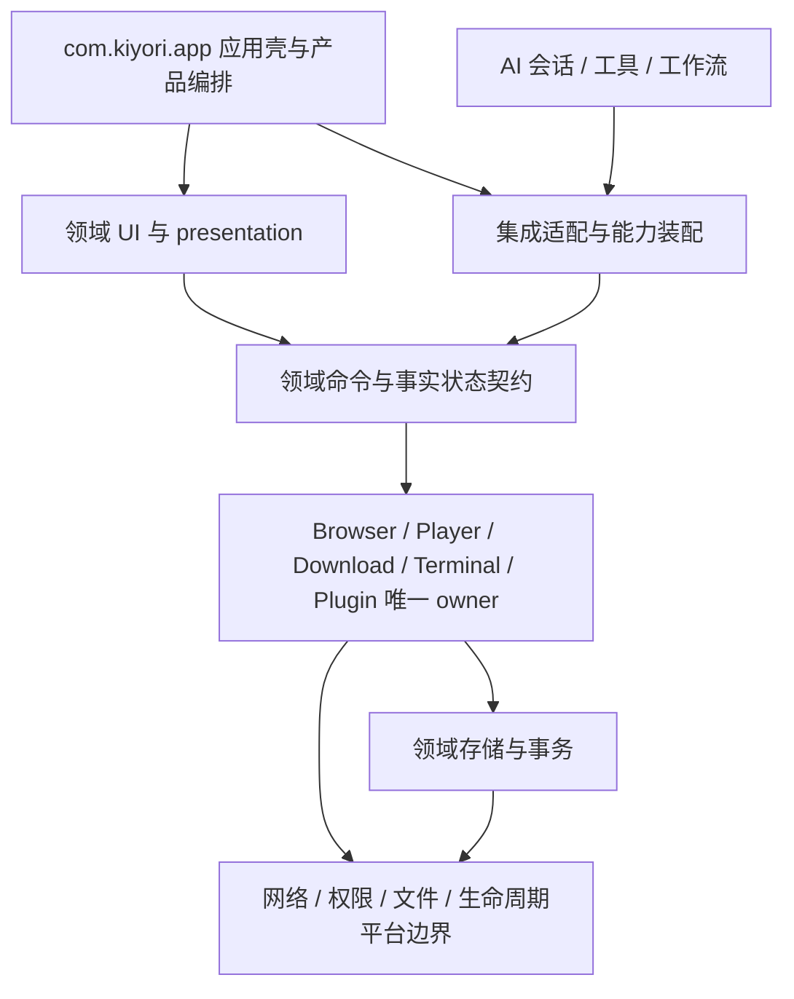

# 全项目重构 v4 设计与实施契约

本文件记录当前源码支持的设计、迁移及验证。进度只在 [总计划](index.md) 维护。
目标是保持全部现有功能与数据，消除真实耦合、重复状态、生命周期缺陷及不可复现输入。
不改变 ROM、产品流程、应用身份或离线能力，不以目录移动量、删除行数或主观比例验收。

## 证据范围与基线

基线为 2026-09-05 `main@65d12a65`，terminal 为 `7ec4cfb1`。9 个 Gradle 模块是
app、terminal、dragonbones、mnn、llama、mmd、fbx、showerclient、quickjs。
跟踪的 main Kotlin/Java 共 1521 文件，app 旧包根 1323、Kiyori 包根 64。
定向导入盘点仍有旧 `core -> ui` 35、`data -> core` 49、Kiyori app -> 旧 UI 68 条。
这些是方向定位线索，不把所有跨目录引用等同于缺陷。

本地正式准备、Debug 构建通过；Python 242 项通过；App JVM 基线 2025 项，2 失败、1
需要显式网络样本的 live-media 测试跳过。完整 Lint 用时 26m31s，报告新增 55 errors /
78 warnings / 1 hint，另有 20 条失效 baseline 项。架构检查有 20 个诊断，集中于后续新增组件、
变更的导航/主题消费者和失效例外。修复时审查其原保护目的，不能仅更新哈希换取通过。

基线 APK：483709823 bytes，SHA-256
`DD7E4327D0C3F969FC0B04E93D21B89BBA0E6B0571C0A3CB42E203F701C7EB2D`，
5514 ZIP 项、无重复名称、44 DEX、53 `.so` 加一个 shell ELF。身份 `com.kiyori`，
45/0.1.0，SDK 26/34/37，arm64-v8a，唯一 launcher 为稳定的旧 MainActivity。
Debug v2 签名及 16 KB ZIP 对齐已验证；完整 ELF/闭包复核纳入 E/F/G。

| 压缩后分类 | bytes | 约束 |
| --- | ---: | --- |
| models | 131675821 | 离线语音/推理输入，不能无消费者证据删除 |
| native | 98492694 | 按进程、ABI、DT_NEEDED、JNI 和动态加载路径分析 |
| DEX | 77406207 | Debug 口径；不能将 Release/R8 结果混作同口径提升 |
| generic assets | 72463994 | 含 Ubuntu rootfs；保留离线安装体验 |
| subpack | 36737593 | 预置 APK 有安装消费者，检查唯一输入 |
| packages | 27521807 | 按生产白名单及 ToolPkg 内容闭包检查 |

没有设备样本，冷/暖启动、TTID/TTFD、首次模块打开、内存/FD/线程、滚动、后台资源、终端
初始化均为待测。桌面编译耗时不作为应用性能。源码与 APK 私有备份及完整原始日志存于
仓库外；可复核摘要保留在此，私有检查点不纳入发布树。

## 目标边界及取舍

选择包级领域收束与内部 API 隔离先行。全量改 namespace 会同时触及 R/BuildConfig、JNI、
反射、Worker、序列化和 Android FQCN，无法用编译单独证明兼容；永久只改品牌又不能消除
实际所有权混乱。独立 Gradle 模块必须满足无依赖环、明确资源/依赖闭包、可独立测试或构建
收益三个条件。先治理构建任务边界，再决定模块粒度；不引入泛化总管理器或服务定位器。

图中 Cap 是领域已存在或按真实调用需求提取的接口集合，不是新建中央分发层。UI 只投影事实
与发命令；AI 使用同一能力入口及权限，不操作具体 Activity/Composable/ViewModel。
允许平台投影 Android 类型；不允许数据仓库依赖 UI 颜色/图形类型，不允许协议和市场 ID
规则定义在屏幕目录。JNI/AIDL/生态适配留在稳定入口，内部实现可迁入 Kiyori 自有领域。

目标目录沿用 `com.kiyori/{app,capability,design,feature,integration,platform}`，新增内容按
browser、download、player、files、workspace、extensions、ai 等实际职责落位。仅被一个域
消费的实现留在该域；不建立新的 `common/utils/manager` 堆积区。旧包根不是自动的兼容区：
每个保留项都需消费者依据，按域迁移后删除旧可执行路径。

### 运行时、数据与失败语义

主进程由 KiyoriApplication/AppShell 装配；Activity 兼容入口继续接收系统 Intent。
Browser Runtime 拥有 WebSession/WebView/配置、脚本和订阅，主线程负责 WebView 操作，IO
负责持久化与规则准备。应用级 owner 不随抽屉重建，页面只解除自己的回调/观察。
PlayerSession 拥有命令与 Surface generation，通过 PlayerRuntimeConnection 连接媒体进程；
Terminal 桥通过 AIDL 连接 TerminalService/TerminalManager，PTY 的完成帧是命令终态权威。
其他实际进程/组件按合并 Manifest 逐项核对，不因包迁移改变隔离。

启动保持首帧必要工作与可延迟初始化的现有区分；每个延迟项记录首次使用成本。全局 owner
只初始化一次，页面生命周期工作必须可取消。请求已提交、提交未知、失败、取消及用户重试
保留各协议真实语义，不能自动重交收费请求或把失败变成功。

持久化由原数据库、DataStore/偏好和存储路径唯一持有；本次首先避免 schema 变化。确需数据
迁移时，工作项必须先补版本、校验、原子提交、幂等和中断恢复测试；源码 bundle 不是运行
数据备份。外部接口适配只能显式委派，禁止双写、第二引擎或自动切换实现。

## 全域源码地图

下表路径相对于 `app/src/main/java`；旧根记为 `O=com/ai/assistance/operit`，新根记为
`K=com/kiyori`。表中“待审”是已定位的未知项，不能被解释成已完成深度审查。

| 领域 / 工作项 | 入口与事实 owner | 调用、数据、资源及待审边界 | 目标与验证 |
| --- | --- | --- | --- |
| 壳/首启/导航 D-01 | K/app/KiyoriApplication、app/shell；稳定 MainActivity | 首启协议、Intent/分享、保留页面 BackHandler、启动协程/系统栏；已有 owner 有效，旧快照漂移 | 保持单一路由/权限 owner；启动、Back、进程重建合同 |
| 设计/设置/权限 D-01 | K/design、platform；O/ui/main/shell 设置；O/ui/permissions | UI 偏好投影与工具权限混在 UI；DataStore 不复制 | 平台权限结果与 UI 引导分离；拒绝/重入/隐藏页测试 |
| AI 会话/供应商 D-03 | O/api/chat/llmprovider、core/chat、services | OpenAIResponses* 提交/恢复边界、流式 parser、会话历史、用户配置；不得真实调用模型 | 保留至多一次与 terminal snapshot；离线协议夹具/并发测试 |
| 工具执行 D-03 | AIToolHandler、ToolExecutionManager、O/core/tools | 调用 UI MessageContentParser/权限；工具取消、结果落盘、脱敏 | 共享能力/解析归属；工具终态和取消传播测试 |
| 记忆/角色/工作流 D-03 | MemoryRepository、角色偏好、WorkflowExecutor/Repository/Scheduler | ObjectBox/Room、图数据、Worker FQCN；MemoryRepository 导入 UI Graph/Color | 数据模型脱离展示，保持 ID/schema/Worker；图/调度特征测试 |
| 浏览器 D-02 | StandardBrowserSessionTools、WebSession、WebSessionBrowserHost | AI/UI 共用静态会话，但下载抽屉另建实例；WebView 主线程、profile、adblock IO 订阅 | 唯一构造与能力投影；会话/关闭/恢复/UA/多窗口 |
| 搜索/书签/历史 D-02 | WebSessionHistoryStore 与 browser policy | 持久化搜索/历史、隐私窗口/首搜导航/书签层级 | 不复制历史和偏好；已有策略测试与设备回归 |
| 广告/扩展脚本 D-02 | BrowserAdBlockStore、UserscriptRepository、WebSessionUserscriptManager | 编译缓存/规则 revision、JS bridge、导航重置与安装权限 | 保持唯一规则快照；缓存损坏/取消/脚本卸载测试 |
| 下载 D-02 | BrowserDownloadManager、BrowserDownloadSettingsStore | 持久任务/恢复、UI/网页/AI/脚本、手动下载仍经 Browser 扩展函数 | 命令边界从页面分离；恢复/重试/删除/重命名事务 |
| 播放/媒体 D-02 | PlayerSession、PlayerRuntimeConnection、MpvPlayerEngine | Surface lease、AIDL、FFmpeg/媒体缓存；依赖 browser 历史/下载类型 | 保留唯一 session，隔离跨域数据；Surface/取消/后台测试 |
| ToolPkg/Skill D-04 | PackageManager、SkillManager、JsEngine | 白名单/注册缓存、QuickJS、bridge、安装更新卸载；metadata 基线失败 | 单一 registry/输入；权限、释放、包一致性合同 |
| MCP/市场 D-04 | MCPManager、MCPRepository、MCPSharedSession、MarketStatsApiService | MCP 缓存连接非原子发布待证；终端 ID 存活待审；市场 ID 规则位于 UI | 连接与配置代际一致；并发、卸载、错误脱敏；不调用真实市场 |
| WebChat/Mini App D-04 | WebChatHttpBridge、O/ui/features/chat/webview/workspace | serviceScope、HTTP 流/工作空间、模板/本地服务器/文件；配置由启动和工具跨层消费 | workspace 业务从 WebView UI 提取；流关闭/路径隔离/配置合同 |
| 文件/SAF/备份 D-05 | FileManagerViewModel、SafFileSystemTools、RawSnapshotBackupManager、RoomDatabaseBackupManager | AI 工具执行文件命令、URI 持久授权、临时归档/rename、备份互斥 | 共享文件能力、事务与取消；目录过期结果/磁盘不足/旧数据 |
| 终端/Ubuntu D-05 | O/core/tools/system/Terminal；:terminal TerminalManager/Service | Binder、PRoot/PTY、rootfs/安装 marker、隐藏/可见命令 FIFO/终态 | 已有命令协议保留；EOF/取消/安装中断/回传测试；设备待验证 |
| 代理/网络 D-05 | browser 网络路由与代理核心、terminal network bridge | loopback/IPv4/HLS/DNS、证书、进程就绪和规则模式 | 一个核心；就绪/取消/域名/证书策略；禁止静默直连 |
| 语音/本地推理 D-06 | SpeechServiceFactory、VoiceServiceFactory、LlamaProvider；:mnn/:llama | 同步 runBlocking 配置读取、本地 lease、sessionLock、音频/native shutdown | 工厂生命周期与取消明确；离线假引擎/lease 并发测试 |
| 虚拟角色 D-06 | O/core/avatar 工厂/controller/renderer；:dragonbones/:mmd/:fbx | GL/Surface、ExoPlayer、model/controller ownership；MP4 release 异常被吞需审 | 控制器/渲染器资源释放；native ABI 不改，设备画面待验证 |
| 构建/资产 E-01 | app/build.gradle.kts、模块 CMake、ci/script、examples、WebChat JS | Gradle 任务混在约 2400 行脚本；现有 npm locks/version catalog；Python .venv | 唯一输入/生成出口、校验/许可；fresh clone 与离线构建合同 |
| 文档/CI G-01 | README、CONTEXT、docs/doc-src、docs/TODO、ci | 巨型历史状态与旧哈希门禁漂移；当前 M05/QD 不能代表全项目 | 唯一权威、语义负例、链接及完整回归 |

showerclient 的远程屏幕协议、quickjs 的 JS ABI 及各 native 模块也纳入 E/D 相应领域，不能
因其是库而跳过依赖和资源审查。源码无需改变时须记录消费者、生命周期和可用测试结论。

## 五条跨域链及失败审查

1. 人工/AI 操作浏览器：Shell/Browser UI 与 Browser 工具 -> getSharedInstance -> 同一
   WebSession/WebView -> 主线程命令 -> 同一窗口/历史投影。下载抽屉 `create` 破坏实例资源
   唯一性；关闭、重挂载、权限拒绝和脚本异步回调必须验证。
2. 网页到下载/播放/文件：WebView 网络资源/下载监听 -> browser 下载请求 ->
   BrowserDownloadManager -> 任务持久化/文件 -> PlayerSession 或文件入口。审查 Cookie/UA
   和代理路由、取消后的文件、恢复去重、删除/重命名；不得新建下载数据库。
3. AI 到工具/代理/终端：会话工具循环 -> AIToolHandler/ToolExecutionManager -> 权限 ->
   Terminal bridge/其他能力 -> AIDL/TerminalManager -> FIFO 输出/完成帧 -> ToolResult。
   取消、Binder 死亡、PTY EOF、代理未就绪必须真实失败或按已有事务恢复语义结束。
4. 插件生命周期：安装来源/manifest -> PackageManager/SkillManager/MCPRepository ->
   注册/缓存 -> JsEngine/MCP client -> 工具结果 -> 更新/卸载。审查更新与正在连接的竞争、
   注册引擎释放、共享终端失效、路径/签名/环境变量边界；使用本地夹具。
5. 启动/恢复：稳定 Application/Activity -> KiyoriApplication/AppShell -> 首启/首屏 ->
   按需领域 owner -> 后台 service/恢复存储 -> 进程重建。首帧、首开成本分别记录；权限页
   不重复申请，隐藏页面不消费 Back，进程级 collector 不由页面多次启动。

## 问题、决策与迁移矩阵

每项在首次源码修改前补精确消费者/测试路径；以下是已有证据支持的首批迁移及全域依赖。
纯移动与行为修正分批验证、提交，避免难以审阅的混合变更。

| 问题 / 工作项 | 旧路径/符号 -> 目标 / 操作 | 接口、删除项和依赖 | 退出证据 |
| --- | --- | --- | --- |
| P-01 / C-01 | 旧快照/精确 UI 消费者 -> 对应当前语义规则 | 追溯 UI 改版与 CropImageActivity 来源；删无效例外，新增越界负例 | 架构全过、负例可失败；不扩大豁免 |
| P-02 / C-01 | bilibili_toolkit manifest author -> 生产元数据合同 | 保留许可/来源归属，核对生成入口，不仅修改产物 | 全白名单 metadata 与包一致性通过 |
| P-03 / C-02 | StandardBrowserSessionTools.create -> private 唯一构造；抽屉 -> shared | 保持 Browser/下载数据；删除页面可用的非共享创建入口 | 构造唯一性、抽屉/AI 共享合同、Debug |
| P-04 / C-03 | MemoryRepository UI 图/颜色 -> 数据图 + presentation 映射 | 无数据库迁移；所有图消费者与测试同批跟进，删旧仓库 UI 依赖 | 相同 ID/边/颜色投影，数据不依赖 Compose |
| P-05 / C-03 | UI normalizeMarketArtifactId -> 市场领域纯规则 | API/UI 共用一份规则；删旧规则定义 | 归一化/非法 ID/调用方编译与测试 |
| P-06 / C-03,D-04 | UI workspace 配置/处理器 -> workspace 业务归属 | 保留文件格式、模板及 JS bridge；UI 留渲染/生命周期 | 配置/路径/工具/启动共同测试，旧路径无业务消费者 |
| P-07 / C-03,D-03 | UI 消息解析/工具权限 -> 能力解析/权限边界 | AI/UI 无第二解析/权限 owner；稳定序列化类型保留 | 流式/工具取消/权限拒绝与兼容特征测试 |
| P-08 / D-04 | MCPManager 连接缓存 -> 配置与连接生命周期一致 | 先重现并发；注册/卸载后旧连接不得重新发布 | 控制连接完成顺序的确定性测试 |
| P-09 / D-06 | SpeechServiceFactory -> 明确配置读取与资源 lease 生命周期 | 先审所有调用方；不保留已关闭实例，不静默换供应商 | 假引擎并发/切换/关闭一次；语音设备待验证 |
| P-10 / D-02..06 | 各领域 current owner -> K/feature、capability、integration | 以全域地图逐项制定精确迁移；稳定入口显式适配；删被替换实现 | 无反向 UI 依赖/第二状态，域测试、Debug、设备清单 |
| P-11 / E-01,F-01 | 内联任务/多生成路径/资源输入 -> 单一构建 owner | 不机械升级依赖/引入 pnpm/pixi/flavor；不移除离线载荷 | fresh clone、输入校验/许可/消费闭包、同口径 APK |
| P-12 / G-01 | 巨型状态流水账 -> 历史载体；当前文档 -> 单一语义权威 | 保留未完成验收、兼容说明及链接 | 链接、架构/兼容对账、全部领域退出证据 |

### C-01/C-02 首批精确实施记录

- `5580c23f9` 将文件长按菜单改为居中 Dialog，并由
  `FileManagerSourceContractTest` 明确禁止该菜单使用底部抽屉。删除通用抽屉测试中这一过期
  消费者要求，仍保留全生产源码禁止 `ModalBottomSheet` 和其他抽屉消费者的检查。
- 同一文件管理改版已修正 `NewFolderDialog.kt` 的真实 package，删除 ARCH012 失效例外，
  使普通路径规则直接约束它。
- `40fdd6aee` 新增 `bilibili_toolkit`，manifest 的 Kiyori 展示 author 与白名单统一合同
  不一致。移除该字段，ID、版本、默认禁用、环境与功能保持；许可证/源码归属不变。
  `GenerateBundledToolPkgAssetsTask` 从 examples 原输入生成包，不手工改 `.toolpkg`。
- Browser 首批改动只包含 `StandardBrowserSessionTools.kt` 和
  `ui/main/shell/KiyoriDownloadDrawerHost.kt` 的构造边界；移除 `create`，共享入口直接创建。
  ARCH047 增加私有构造、唯一 factory、同步发布与禁止页面非共享调用的语义检查；
  `ci/test/test_browser_runtime_ownership.py` 使用独立正例、非共享 factory、未同步发布、
  注释/字符串伪造和缺失 owner 反例。修改前检查已在真实源码报告非共享入口及抽屉消费者。
- 本批仍不关闭 C-01 的其他旧快照治理或 C-02 的下载命令边界。后续每一批依据已验证输出
  更新总计划，不能把本条实现意图作为测试通过证据。

2026-09-05 首批验证：App JVM 337 suites / 2025 tests / 0 failures / 0 errors / 1 live-media
skip，4m22s；Python 247 项通过；ARCH047 实际源码检查通过；formal readiness、变更 Markdown
链接和 diff 检查通过。Debug 构建 2m20s，235 tasks，26 executed / 209 up-to-date。
APK 生成于 06:57:53 +08:00，483709823 bytes，SHA-256
`95F9A07D7E7D5E6FD4B47811915305AF32550E41262655F80CDE43ABAF86661D`。
身份/版本/SDK/唯一 launcher/arm64 与基线一致，v2 单签名和 16 KB ZIP 对齐通过，构建内置
proxy/player 打包检查通过，ZIP 无重名；包内 Bilibili manifest 无 author，证明生成出口已
消费变更。本批字节数与基线相同，不宣称包体或运行速度提升。其余基线架构/Lint 问题和设备
验收继续保留。

## 兼容与上游维护

继续使用 [稳定标识清单](8_compatibility_contract_inventory.md)，逐项校正消费者和状态。
`Operit` 用途必须归入：当前品牌、自有内部实现、上游/补丁来源、外部协议、持久化、系统
入口、许可证/历史。内部命名按域迁移，保留名称必须具体到 bridge/JNI/AIDL/Worker/数据
消费者，不接受仅以“来自上游”解释。

applicationId `com.kiyori` 和签名保持；Gradle namespace 本轮暂保留，因为 R/BuildConfig
与反射/库代码的收益尚不足以覆盖兼容风险。Kotlin/Java 内部包仍按所有权迁移，这两个决策
互不替代。Manifest Activity/Service/Provider、authority、Intent/deep link/OAuth、AIDL、
JNI、R8、WorkManager、序列化、Room/ObjectBox、偏好和备份分别审计。

成熟 AI/native/terminal 引擎继续选择性吸收上游，记录来源提交与迁移路径；Kiyori Shell、
Browser、下载、Player 和产品协同独立维护。遵守许可证及作者来源，不全量合并 upstream，
不把重构写成新的引擎。构建草案中的 pnpm/pixi/多变体/自动补丁发布仍须现实收益证明。

## 里程碑执行与验收

各工作项继承以下契约并在实施记录中补精确文件：目标只覆盖其领域；非目标是改变其他域
行为、持久化和外部接口；依赖来自总计划和迁移矩阵；恢复点是已验证父子提交/源码 bundle。
有运行数据改变时，独立数据恢复设计是前置条件。未验证设备行为保持 `verification_pending`。

验证先执行领域行为/契约测试，再按共享影响扩展。命令入口沿用
[验证命令目录](14_validation_command_catalog.md)，不发明重复门禁。阶段退出至少有：
问题重现/特征保护、实现差异反查、必要领域测试、`git diff --check`、串行
`./gradlew :app:assembleDebug --no-daemon --console=plain` 及新 APK 检验。
全局收口包含完整 JVM/JS/TS/Python、架构、Lint、正式准备、新鲜克隆、Markdown 检查，
APK Manifest/身份/签名/ABI/ZIP+ELF 对齐/native 闭包/ToolPkg 白名单和资产一致性。

性能比较使用相同构建类型/配置/设备/样本/冷热缓存；结构性消除重复实例可用确定性测试
证明，但不能据此编造运行内存或速度百分比。包体采用相同 ZIP 分类，记录迁移后的代价。

设备清单覆盖启动/首启、隐藏页 Back、人工/AI 共用会话、工具取消与失败、多窗口/UA/缩放、
广告/脚本生命周期、下载恢复、Player 前后台/旋转/Surface、文件/SAF/备份导入、代理/DNS/
loopback、Ubuntu 激活/PTY，并组合进程死亡、断网、权限拒绝、磁盘不足及旧数据。具体改动
补精确步骤和期望，不把当前无设备授权解释为已通过。

最终交付先完成本地可执行工作与精确最终树审计，再推送父子自有 main；子模块有变更先
推送子提交并验证可获取，再更新父 gitlink。禁止强推。local HEAD、origin/main、远端
refs/heads/main 三者必须一致；设备和实际运行性能缺项保持单独待验证状态，总 Goal 不
因本地提交或时间消耗而虚假完成。
