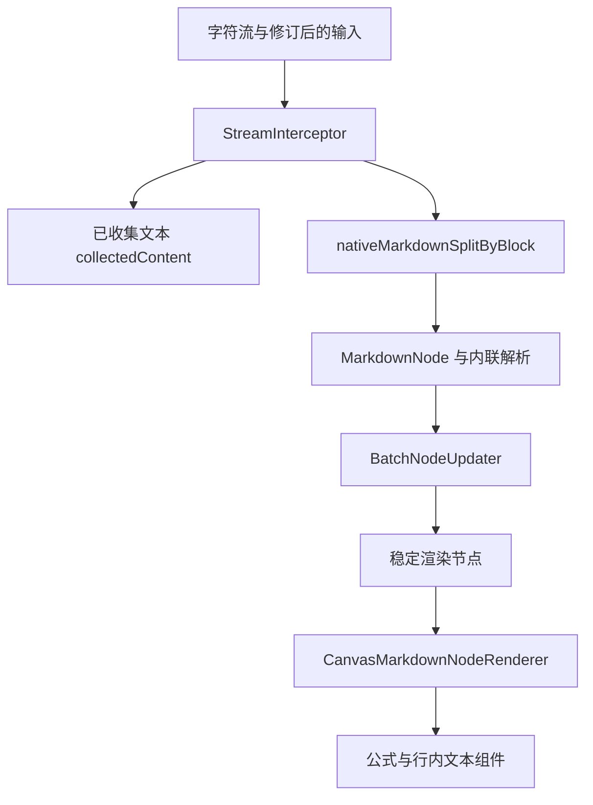

# 流式 Markdown 渲染架构

本文描述当前 Android 聊天气泡的 Markdown 路径，适用于定位分块、节点更新、公式与流式修订问题。
2026-09-14 按源码核对：主入口使用 native 分块；旧 Kotlin KMP 工具仍存在，但不能据此把它描述为
当前主渲染路径，也不能从“流式”推导出固定内存或任意长文本的性能保证。

## 当前数据流



`StreamMarkdownRenderer` 捕获输入并持有节点状态，通过 `nativeMarkdownSplitByBlock` 接收块。
`NativeMarkdownSplitter` 维护 JNI session 与推送/释放接口。块类型决定普通文字、列表、引用、
代码、公式、XML 与其他内容的解析和显示；内联解析继续使用对应 native 路径。

## 状态与生命周期

- `StreamMarkdownRendererState` 保存节点、稳定投影、收集文本、转换缓存与 XML 子流；输入变化时按当前生命周期重置。
- `StreamInterceptor` 在字符通过时追加 `collectedContent`。节点及缓存也占用内存，流式输入不等于不保存全文。
- `BatchNodeUpdater` 合并节点发布，减少逐字符 UI 更新；渲染器身份用于约束旧更新的作用范围。
- 协程取消、流式结束、修订后的重建和异常路径需分别验证；UI 显示的完成状态不能只从 EOF 或部分文字推断。

## Native 与历史 Kotlin 工具的关系

`util/stream/StreamKmpGraph.kt` 和相关插件仍提供 Kotlin 流处理能力，其模式 DSL 与正则捕获
属于该工具实现。它们的存在不能证明当前 `StreamMarkdownRenderer` 通过 `splitBy(blockPlugins)`
处理主对话；新增语法必须核对真正的 native 块/内联分类和节点消费者。

不要把单一模式匹配算法的复杂度扩展为整个渲染流水线的耗时结论。正则捕获、节点数、内容缓存、
公式布局、图片、Compose 重组和设备资源都会影响最终表现。性能优化必须给出输入规模、设备、
采样方法和前后结果，不能保留“零回溯”“极低内存”或无界输入保证作为产品合同。

## 修改与验证入口

| 环节 | 权威源码或记录 |
| --- | --- |
| 主入口与节点生命周期 | [StreamMarkdownRenderer.kt](../../../app/src/main/java/com/ai/assistance/operit/ui/common/markdown/StreamMarkdownRenderer.kt) |
| JNI session 与分块接口 | [NativeMarkdownSplitter.kt](../../../app/src/main/java/com/ai/assistance/operit/util/streamnative/NativeMarkdownSplitter.kt) |
| 旧 Kotlin 流工具 | [工具说明](../../../app/src/main/java/com/ai/assistance/operit/util/stream/README.md) |
| 公式兼容与样例 | [Markdown/LaTeX 专项](../../TODO/markdown_latex_rendering_compatibility/index.md) |
| 流式渲染与结束边界 | [渲染可靠性专项](../../TODO/ai_chat_rendering_reliability/index.md) |

验证至少覆盖代码围栏中的公式定界符、跨 chunk 定界符、未闭合代码/公式、取消后晚到更新、
工具修订与长文本。静态、JVM 和 Debug 构建只证明对应层次；设备字体、横向滚动、手势、帧率
和内存峰值需要单独实测。

## 公式渲染边界

AI 对话中的公式继续使用一条原生链路：

```text
StreamMarkdownRenderer
  -> CanvasMarkdownNodeRenderer
  -> DisplayMathBlock / MarkdownInlineSpannable
  -> LatexCache
  -> jlatexmath-android 0.2.0
```

KaTeX 只参与 MathML/纯文本转换，不承担聊天气泡内的公式绘制。公式边界仍由块级和内联
Markdown 节点决定，代码区中的数学定界符保持字面文本；流式块公式在结束定界符到达前不会
作为已完成公式节点提交。

`prepareLatexForJLatexMath` 在公式节点内部执行局部兼容处理：

- 将缺失的 `\lvert`、`\rvert`、`\lVert`、`\rVert` 转为后端已有的
  `\mathopen` / `\mathclose` 与 `\vert` / `\Vert`
- 将后端不识别的控制空格 `\ `，以及单反斜杠紧接 `LF`/`CRLF` 的输入，转为已支持的
  `\;` 数学间距；物理行尾仍保留为换行，便于诊断位置对应源码结构
- 将基础 `\ce{...}` 化学语法转为同一后端可解析的 `\mathrm`、上下标和箭头表达式

化学兼容层覆盖元素与下标、计量系数、单符号电荷、显式上下标电荷、常见反应箭头、
沉淀/气体标记、分组/状态和核素混合 LaTeX。它不是完整 `mhchem` 实现；复杂箭头标签、
复杂键语法和其他未声明扩展不属于当前合同。

块级公式按容器宽度计算显示尺寸：轻微超宽时等比缩小，最小保持 `0.8`；仍然超宽时只在
公式区域横向滚动，不压缩成不可读图片。渲染失败时显示明确错误标识，并用容器宽度换行展示
完整原始公式。开发构建日志记录原始公式、预处理公式、变换列表、后端版本、异常类型和消息、
命令及位置来源。
