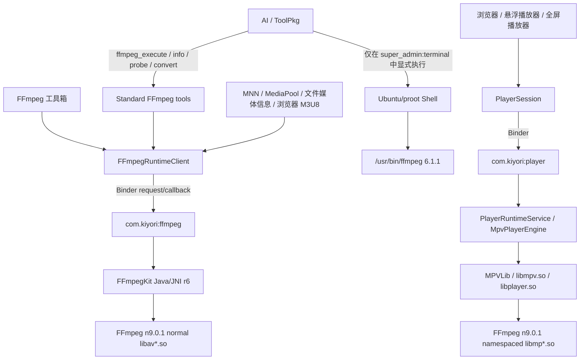
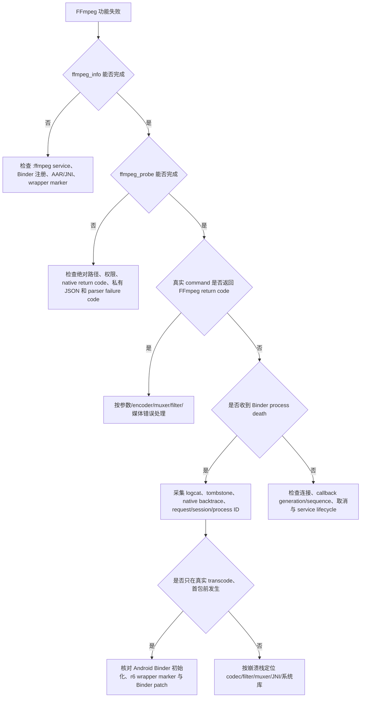

# Kiyori FFmpeg 架构与开发指南

## 1. 文档目标、范围与权威边界

本文是 Kiyori 中 FFmpeg 相关执行角色、进程/API 合同、失败语义、开发约束、构建供应链和验证策略的
长期维护指南。它解决的核心问题不是“项目里有几个版本号”，而是：

- 哪个调用者在什么进程中执行哪一套媒体能力；
- AI、应用内部媒体处理和播放器是否走到正确的执行面；
- Android 两套 FFmpeg native closure 为什么必须隔离；
- Ubuntu `/usr/bin/ffmpeg` 为什么不是 Android 产品运行时；
- FFmpegKit r3 的现场进程死亡如何归因，r4/r5 修复了什么，r6 如何修复真实 AI 使用合同；
- 新增 codec、修改工具 API、升级 FFmpeg 或调整播放器时应经过哪些门禁。

本文覆盖：

1. Ubuntu/proot 终端 FFmpeg；
2. Android `:ffmpeg` 进程中的 FFmpegKit normal-name closure；
3. Android `:player` 进程中的 mpv namespaced FFmpeg closure；
4. AI `ffmpeg_execute`、`ffmpeg_info`、`ffmpeg_probe`、`ffmpeg_convert`；
5. 工具箱、MNN、MediaPool、媒体信息与浏览器 M3U8 合并；
6. Binder 请求、日志、线程、取消、终态和进程死亡；
7. native 构建、审计、成对 promotion、APK 与设备验收。

本文不承担以下职责：

- 精确 native 成员、SONAME、`DT_NEEDED`、ELF、哈希和许可证清单继续以
  [Player native stack](PLAYER_NATIVE_STACK.md) 为详细说明；
- 版本、commit、构建参数、patch 和选定产物以
  [`tools/player_native_build/closure_manifest.json`](../../../tools/player_native_build/closure_manifest.json)
  与
  [`tools/ffmpegkit_native_build/closure_manifest.json`](../../../tools/ffmpegkit_native_build/closure_manifest.json)
  为机器可读最终权威；
- ToolPkg/脚本调用方式以 [FFmpeg 包开发 API](../package-dev/ffmpeg.md) 为公开接口说明；
- FFmpeg API/runtime 当前阶段进度、验证证据和未完成验收以
  [FFmpeg 运行时完善计划](../../TODO/ffmpeg_runtime_completion/index.md) 为状态权威；
- 播放器 native closure 的历史迁移与设备验收继续以
  [阶段 14：播放器原生依赖升级与 closure 迁移](../../TODO/kiyori_browser_product_completion/14_player_native_dependency_upgrade.md)
  为状态权威。

状态解释：

- **当前事实**：已由当前源码、manifest、产物或自动检查确认；
- **历史事实**：只描述指定版本或指定日期的证据；
- **目标设计**：后续实现必须满足，但当前代码可能尚未闭环；
- **待验证**：仍需要目标设备、真实网络或用户现场证据。

## 2. 核心结论

Kiyori 当前不是“Ubuntu 一个 FFmpeg、Android 一个 FFmpeg”，而是三个相互隔离的执行面：

| 执行面 | 运行位置 | 主要调用者 | 主要用途 | 当前版本与状态 |
| --- | --- | --- | --- | --- |
| Ubuntu 终端 FFmpeg | Ubuntu/proot rootfs | AI 显式调用 `super_admin:terminal` | Shell CLI、开发诊断、通用媒体命令 | `/usr/bin/ffmpeg 6.1.1`；现场功能测试正常 |
| Android FFmpegKit | 非导出 `com.kiyori:ffmpeg` | AI FFmpeg 工具、工具箱、MNN、MediaPool、媒体信息、浏览器 M3U8 合并 | 命令执行、转码、探测、remux | FFmpeg `n9.0.1`，wrapper `8.1.7-kiyori-n9.0.1-r6`；r5 核心媒体矩阵已真机通过，r6 stdout/profile/GPL-filter 增量本地闭环完成、目标设备待验证 |
| Android mpv FFmpeg | 非导出 `com.kiyori:player` | `PlayerSession`、浏览器/悬浮/全屏播放器 | 播放器解封装、解码、网络读取、滤镜 | mpv `2339eb727` + FFmpeg `n9.0.1`；独立设备播放矩阵待验证 |

版本策略必须区分三件事：

1. **源码版本一致**：可以让不同平台从同一 FFmpeg tag/commit 构建；
2. **二进制一致**：Android NDK ELF 与 Ubuntu glibc ELF 不可能是同一个二进制；
3. **能力一致**：外部库、TLS、codec、硬件 API、configure flags 和许可证不同，版本号相同也不代表能力相同。

当前 Android 两套产品 closure 已对齐到 FFmpeg `n9.0.1` 的固定 commit
`bf1b838f2ab88b4f8fd83443325c782ea0e0f7fa`。Ubuntu `/usr/bin/ffmpeg 6.1.1` 仍由 Ubuntu rootfs
包管理链提供；它可以单独升级到同一源码版本，但必须建立独立 Linux/aarch64 构建和包管理合同。

## 3. 术语

| 术语 | 含义 |
| --- | --- |
| 执行面 | 一条有明确调用者、进程、ABI、依赖、日志和失败语义的媒体执行链 |
| native closure | 一个运行时完整需要的 ELF、资源、Java/JNI 接口、外部库和许可证闭包 |
| normal-name closure | 使用 `libavcodec.so`、`libavformat.so` 等标准 basename 的 FFmpegKit 闭包 |
| namespaced closure | 为播放器隔离而使用 `libmpcodec.so`、`libmpformat.so` 等名称的 mpv FFmpeg 闭包 |
| runtime generation | 主进程每次建立 `:ffmpeg` Binder 连接时分配的连接代次，用于拒绝旧进程事件 |
| event sequence | `:ffmpeg` 在一个 runtime generation 内递增的回调序号，用于拒绝重复或乱序终态 |
| request ID | 32 位小写十六进制请求标识，关联请求、session、日志和终态 |
| native owner | 同一时刻唯一拥有完整 FFmpeg/FFprobe 顶层 JNI 执行权的请求 |
| product AAR | `app/libs/` 中被 Gradle 实际打包的经过审计的 AAR |
| source AAR | 从固定源码和工具链完整构建的原始闭包 |
| thin/aligned candidate | 去除重复 owner、完成 namespace/16 KiB 对齐并等待成对 promotion 的候选 AAR |

## 4. 总体架构



三条链没有运行时自动切换关系：

- `ffmpeg_execute` 不执行 `/usr/bin/ffmpeg`；
- 播放器不调用 `FFmpegRuntimeClient`；
- Ubuntu 命令成功不证明 Android FFmpegKit 或 mpv 播放器通过；
- `:ffmpeg` 进程死亡不等于 `:player` 进程死亡；
- 不以一个执行面的结果替代另一个执行面的验收。

## 5. 进程、组件与所有权矩阵

| 组件 | 所在进程 | 是否加载 FFmpeg native | 责任 |
| --- | --- | --- | --- |
| AI/ToolPkg 调度 | 主进程 | 否 | 构造工具参数、等待结果、展示错误 |
| `FFmpegRuntimeClient` | 主进程 | 否 | Binder 连接、请求挂起、取消、进程死亡、日志读取 |
| `FFmpegRuntimeService` | `:ffmpeg` | 是，normal-name FFmpegKit | FIFO 调度、session、日志、statistics、唯一终态 |
| `StandardFFmpegToolExecutor` | 主进程后台线程 | 否 | AI 原始 FFmpeg 参数执行 |
| `StandardFFmpegInfoToolExecutor` | 主进程后台线程 | 否 | 查询 Android `:ffmpeg` wrapper/FFmpeg/build 信息和固定能力分区 |
| `StandardFFmpegProbeToolExecutor` | 主进程后台线程 | 否 | 使用同一 Android `:ffmpeg` FFprobe 投影结构化媒体信息 |
| `StandardFFmpegConvertToolExecutor` | 主进程后台线程 | 否 | `h264_aac_mp4` 确定性转换、FFprobe 回读和原子非覆盖提交 |
| `PlayerSession` | 主进程 | 否 | 唯一播放器会话、URI/header/位置/Surface 状态 |
| `PlayerRuntimeService` / `MpvPlayerEngine` | `:player` | 是，mpv namespaced closure | 播放、解码、网络、Surface、播放器诊断 |
| Ubuntu Shell | proot 进程空间 | 是，Linux CLI | Shell 管道、重定向、脚本化媒体处理和开发诊断 |

Android Manifest 中的两个服务均为 `android:exported="false"`：

```text
PlayerRuntimeService -> android:process=":player"
FFmpegRuntimeService -> android:process=":ffmpeg"
```

这两个进程隔离的是 native 崩溃域和 native basename owner，不是把同一个命令同时执行两次。

## 6. Ubuntu `/usr/bin/ffmpeg`

### 6.1 定位

Ubuntu 侧提供真正的 CLI：

```text
/usr/bin/ffmpeg
/usr/bin/ffprobe
```

它由 Ubuntu/proot rootfs 的包管理系统提供，当前现场版本为 `6.1.1-3ubuntu5`。AI 只有显式调用
`super_admin:terminal` 并在 Shell 中输入 `ffmpeg` 时才会使用这条链。

Shell 负责解释：

- `|` 管道；
- `>`、`2>&1` 重定向；
- `&&`、`;` 命令链；
- glob、环境变量和命令替换。

因此 Ubuntu CLI 能执行：

```bash
ffmpeg -encoders 2>&1 | grep -i h264
```

同样的字符串不能传给 Android `ffmpeg_execute`，因为后者不经过 Shell。

### 6.2 为什么它不属于 Android 产品媒体栈

Ubuntu FFmpeg：

- 不由 Android `FFmpegRuntimeService` 加载；
- 不参与 `ffmpeg_execute`、`ffmpeg_info` 或 `ffmpeg_convert`；
- 不参与 MediaPool、MNN、文件媒体信息或浏览器 M3U8 合并；
- 不参与 `PlayerSession` 和 mpv 播放；
- 依赖 Linux userspace、glibc 和 Ubuntu rootfs 外部库；
- 生命周期和权限受终端环境管理，而不是 Android Service/Binder 合同管理。

把 Ubuntu FFmpeg 作为 Android `:ffmpeg` 的替代执行通道，会改变权限、文件访问、进程生命周期、
取消、日志、错误语义、安装依赖和用户可用性，当前架构禁止这种隐式切换。

### 6.3 为什么没有直接把 6.1.1 覆盖成 9.0.1

Android 的 `n9.0.1` AAR 不能复制到 `/usr/bin/ffmpeg`，原因包括：

1. Android 构建是 NDK/Bionic 目标，Ubuntu CLI 是 Linux/glibc 目标；
2. Android FFmpegKit manifest 使用 `--disable-programs`，命令层进入 `libffmpegkit.so`，没有可复制的
   Android `ffmpeg` CLI；
3. Ubuntu 需要 `ffmpeg`、`ffprobe` 程序、动态链接器、Linux SONAME 和独立外部库；
4. Android MediaCodec、SAF、JNI、Binder patch 对 Ubuntu CLI 没有相同语义；
5. Ubuntu 包管理必须负责文件所有权、升级、卸载、依赖、许可证与安全更新；
6. 同一源码 commit 在两个目标平台的 configure flags、encoder、TLS 和硬件能力不会自然一致。

因此，“统一到 9.0.1”是一个独立工程任务，不是复制或覆盖一个文件。

### 6.4 Ubuntu n9.0.1 独立升级目标设计

后续决定统一 Ubuntu 源码版本时，必须建立单独的 Linux/aarch64 profile：

1. 固定 FFmpeg tag `n9.0.1` 和 commit
   `bf1b838f2ab88b4f8fd83443325c782ea0e0f7fa`；
2. 新增机器可读 manifest，记录 glibc 基线、compiler、binutils、外部库、configure flags、许可证、
   source-lock 和产物哈希；
3. 同时构建 `ffmpeg` 与 `ffprobe`，不复用 Android `--disable-programs` 配置；
4. 固定 encoder、decoder、filter、format、protocol 和 TLS 能力清单；
5. 生成可审计 `.deb`，由包管理器拥有 `/usr/bin/ffmpeg` 与 `/usr/bin/ffprobe`，禁止手工覆盖
   apt 管理文件；
6. 建立旧 rootfs 升级、全新 rootfs 安装、卸载、重装和缓存清理测试；
7. 运行 Ubuntu 全功能回归、输入输出兼容性、Shell 管道、终端工具和 AI 指令回归；
8. 完成 GPL/LGPL、external codec 和 source-offer 审计；
9. 只有候选包与 rootfs 回归全部通过，才修改终端环境的正式包来源。

建议的长期版本策略是：

- Android `:player` 与 `:ffmpeg` 保持同一固定 FFmpeg source commit，继续作为成对 native major
  promotion；
- Ubuntu 终端可对齐同一 source commit，但保持独立 manifest、build profile、包和测试矩阵；
- 文档和工具输出分别报告 `platform/profile/version/commit/capabilities`，不只报告一个版本字符串。

## 7. Android `:ffmpeg` 执行面

### 7.1 调用链

```text
AI / ToolPkg / Toolbox / internal consumer
  -> FFmpegRuntimeClient
  -> IFFmpegRuntime Binder
  -> com.kiyori:ffmpeg
  -> FFmpegRuntimeService
  -> FFmpegKitConfig.ffmpegExecute / ffprobeExecute
  -> libffmpegkit.so
  -> normal-name FFmpeg n9.0.1 libav*.so
```

产品 AAR：

```text
app/libs/ffmpeg-kit-player-arm64.aar
wrapper = 8.1.7-kiyori-n9.0.1-r6
size    = 30,486,441 bytes
SHA-256 = 7E6B4C20A93DFB3B90BC7F3C5D724CF657B70E2469EA4F2B1110396A8D345394
```

native 成员：

```text
libavcodec.so
libavdevice.so
libavfilter.so
libavformat.so
libavutil.so
libffmpegkit.so
libffmpegkit_abidetect.so
libswresample.so
libswscale.so
```

这里没有 Android `ffmpeg` 可执行程序。manifest 明确要求 `--disable-programs`；FFmpeg 命令层与
FFprobe 命令层由 FFmpegKit JNI 在 `libffmpegkit.so` 内调用。

### 7.2 应用内部消费者

| 消费者 | 操作 | 目标语义 |
| --- | --- | --- |
| AI `ffmpeg_execute` | `EXECUTE_COMMAND` | 接受 FFmpeg 参数字符串，不接受 Shell |
| AI `ffmpeg_info` | `RUNTIME_INFO` | 按固定 section 返回 Android `:ffmpeg` 版本、构建或能力文本 |
| AI `ffmpeg_probe` | `PROBE_MEDIA` | 由 Android FFprobe 写私有 JSON，返回受控结构化媒体信息 |
| AI `ffmpeg_convert` | `EXECUTE_ARGUMENTS` + `PROBE_MEDIA` | 唯一 `h264_aac_mp4` profile、临时输出、回读和原子提交 |
| FFmpeg 工具箱 | FFmpeg runtime | 后台等待结果，不阻塞 Compose 主线程 |
| `FFmpegUtil` | command/arguments/probe | 应用内部统一适配层 |
| `MediaPoolManager` | `EXECUTE_ARGUMENTS` | 媒体预处理和压缩，当前 H.264 路径使用 `libopenh264` |
| MNN 媒体预处理 | FFmpeg runtime | 模型输入所需媒体转换 |
| 文件媒体信息 | `PROBE_MEDIA` | 使用 FFprobe media information |
| 浏览器 M3U8 合并 | `EXECUTE_ARGUMENTS` | 下载完成后的确定性 remux/merge |

主进程不得重新出现以下直接调用：

```text
FFmpegKit.execute(...)
FFmpegKitConfig.ffmpegExecute(...)
FFprobeKit.getMediaInformation(...)
FFmpegKitConfig.getMediaInformationExecute(...)
```

所有产品调用必须经过 `FFmpegRuntimeClient`，保证 native 只在 `:ffmpeg` 进程加载。
`PROBE_MEDIA` 直接创建 `FFprobeSession` 并调用 `FFmpegKitConfig.ffprobeExecute(session)`；它不再
依赖 FFmpegKit 8.1.7 从日志重建 media-information JSON。

## 8. Android `:player` 与 mpv FFmpeg 执行面

播放器调用链：

```text
Browser / Floating / Fullscreen
  -> PlayerSession
  -> player Binder
  -> com.kiyori:player
  -> PlayerRuntimeService
  -> MpvPlayerEngine
  -> MPVLib
  -> libmpv.so / libplayer.so
  -> namespaced libmp*.so
```

产品 AAR：

```text
app/libs/mpv-player-arm64.aar
size    = 50,926,119 bytes
SHA-256 = F52ACA6F35C651BE7AAB55F2EFE6B5F40180D1EBAEB1404CC446470BF8DEB6A4
```

native 成员：

```text
libc++_shared.so
libmpcodec.so
libmpdevice.so
libmpfilter.so
libmpformat.so
libmputil.so
libmpresample.so
libmpscale.so
libmpv.so
libplayer.so
```

播放器不调用：

```text
ffmpeg_execute
ffmpeg_convert
FFmpegRuntimeClient
FFmpegKitConfig.ffmpegExecute
/usr/bin/ffmpeg
```

`libmp*.so` 来自播放器自己的 FFmpeg `n9.0.1` closure。标准 FFmpeg basename 和内部
SONAME/`DT_NEEDED` 被一致改写，以避免和 `:ffmpeg` 的 normal-name closure 冲突。

播放器与 `:ffmpeg` 的验证必须分开：

- `:ffmpeg` 重点验证命令、转码、探测、取消、FIFO、日志和进程死亡；
- `:player` 重点验证网络播放、demux、decoder、MediaCodec、Surface、seek/cache、GPU 和长时间播放。

## 9. AI FFmpeg 工具语义

### 9.1 `ffmpeg_execute`

`ffmpeg_execute` 接受的是 **FFmpeg 参数**，不是 Shell 命令。

正确：

```text
-y -i "/storage/emulated/0/Download/input.mp4" -c copy "/storage/emulated/0/Download/output.mp4"
```

错误：

```text
ffmpeg -i input.mp4 output.mp4
-encoders 2>&1 | grep -i h264
-i input.mp4 output.mp4 && ffprobe output.mp4
```

约束：

- 不带 `ffmpeg` 前缀；
- 不使用管道、重定向、命令链或外部程序；
- 字符串由 FFmpegKit 参数解析器处理，不由 Shell 处理；
- 工具边界拒绝未被引号或反斜杠保护的 Shell operator、重定向和前缀 executable，但不改写合法参数；
- 路径中的空格需要正确引号；
- Android `drawtext` 必须显式使用绝对 `fontfile`，例如
  `/system/fonts/Roboto-Regular.ttf`；
- 内部 Kotlin 调用应使用 `executeArguments(List<String>)`，避免二次字符串解析。

历史现场中的 `Unrecognized option 'iE'` 是 `grep -iE` 被错误传给 FFmpeg 后产生的普通参数错误。
相关 `-1414549496` 不是 `:ffmpeg` 进程死亡码；真正的进程死亡没有 FFmpeg return code，由 Binder
death 转换为 `FFmpegRuntimeProcessDiedException`。

### 9.2 `ffmpeg_info(section)`

`ffmpeg_info` 查询的是 Android `:ffmpeg`，不是 Ubuntu `/usr/bin/ffmpeg`。当前返回：

- `summary`：执行面、进程、ABI/API、FFmpegKit wrapper、FFmpeg、build date、资格化 profile
  和工具路由规则；
- `codecs/encoders/decoders/filters/formats/muxers/demuxers/protocols/hwaccels/buildconf`：
  各自固定映射为一个 FFmpeg 信息参数，不使用 Shell。

能力文本不等于已验证 encoder/profile 合同。AI 检查 Android encoder 或 filter 时应选择对应
section，不应把 `| grep` 传给 `ffmpeg_execute`，也不能从 codec family 推断 `-c:v` encoder。

### 9.3 `ffmpeg_probe`

`ffmpeg_probe(input_path)` 使用与 `ffmpeg_convert` 输出验证相同的 Android `:ffmpeg` 执行面。
输入必须是存在、非空、绝对路径的普通文件。

FFmpeg n9.0.1 的 FFprobe 通过 `AVTextWriter` 写 stdout；FFmpegKit 8.1.7 的
`getMediaInformationExecute()` 只收集 `AV_LOG_STDERR`，因此 native return code 可以为 `0`，
但 wrapper 仍得到 `mediaInformation=null`。r5 冻结实现为：

1. 使用 FFprobe 官方 `-o` 写入 `cacheDir/ffmpeg-runtime-probes/<request-id>.json`；
2. `-show_entries` 只生成合同字段，不输出 tags、side data 等无关元数据；
3. 文件最大 `1 MiB`、最多 `128` 条流、单字符串最多 `4096` 字符，并使用严格 UTF-8；
4. 只投影 format name、duration、bitrate，以及 stream index/type/codec/profile/pixel format/
   width/height/frame rate/sample rate/channels；
5. JSON 不进入 Binder，不进入公共存储；
6. 成功、失败、取消和 service 重建路径均清理该文件；
7. native 成功但 JSON 缺失、超限或格式错误时，返回
   `MEDIA_INFORMATION_INVALID` protocol failure，不伪造 FFmpeg return code。

profile 字段允许 FFprobe 输出 string 或 integer；H.264 constrained baseline 的数值 `578`
统一投影为字符串，供转换合同精确判断。

### 9.4 `ffmpeg_convert`

Kiyori 尚未发布，因此本轮直接删除了旧的 `video_codec`、`audio_codec`、`format` 和 `bitrate`
简化参数，不保留旧枚举、兼容分支或转换失败后的替代路径。当前公开参数为：

```text
input_path
output_path
profile?
resolution?
video_bitrate?
```

默认且唯一支持的 profile：

```text
profile          = h264_aac_mp4
video encoder    = libopenh264
video profile    = constrained_baseline
pixel format     = yuv420p
audio encoder    = aac
container        = mp4
movflags         = +faststart
```

输出合同接受 `Constrained Baseline` 和语义等价的数值 `578`；普通 baseline `66` 不含 constrained
flag，继续拒绝。

参数与文件合同：

- 输入、输出必须是最多 `4096` 字符的绝对路径；
- 输入必须是非空普通文件，输入输出 canonical path 不能相同；
- 输出父目录必须已经存在；
- 输出扩展名必须是 `.mp4`；
- 最终输出必须不存在；
- resolution 必须是 `16..8192` 内的偶数宽高；
- video bitrate 必须是 `64k..100M`；
- 不支持的 profile 在进入 Binder/native 前拒绝。

执行与提交合同：

1. 使用 `executeArguments(List<String>)`，不拼接 Shell/命令字符串；
2. 固定 `-nostdin -hide_banner -n`；
3. 映射 `0:V:0` 和 `0:a:0?`，避免 attached picture 变成主视频；
4. 在最终目录写唯一 `.partial.mp4`；
5. 要求临时输出非空；
6. 用 `PROBE_MEDIA` 回读正时长、MP4、唯一 H.264 视频流、Constrained Baseline、
   `yuv420p`、请求分辨率，以及最多一条 AAC 音频流；
7. 只有回读通过才使用同目录 `ATOMIC_MOVE` 提交；
8. 同一进程对相同目标串行提交，提交时再次拒绝已存在目标；
9. 任意失败删除本次临时文件，不覆盖旧目标；
10. 不重试、不换 encoder、不切换 Ubuntu 或播放器 closure。

需要显式覆盖的高级命令仍由调用者使用 `ffmpeg_execute ... -y ...` 表达。

其它 codec/profile 的开放条件不变：必须在 machine-readable manifest 中增加唯一映射和
二进制 marker，通过 AAR/APK 门禁、输出回读和目标设备实际编码验证后再公开。

## 10. Binder 请求与回调合同

### 10.1 AIDL

服务端接口：

```text
registerCallback(runtimeGeneration, callback)
submit(runtimeGeneration, request)
cancel(runtimeGeneration, requestId)
```

回调：

```text
onRequestStarted
onRequestCompleted
onRequestFailed
```

操作类型：

```text
EXECUTE_COMMAND
EXECUTE_ARGUMENTS
PROBE_MEDIA
RUNTIME_INFO
```

正常终态：

```text
SUCCEEDED
FAILED
CANCELLED
```

runtime 设置/协议失败码：

```text
INVALID_REQUEST
DUPLICATE_REQUEST
DISPATCH_FAILURE
CALLBACK_REPLACED
CALLBACK_DISCONNECTED
SERVICE_DESTROYED
```

### 10.2 请求不变量

- request ID 必须匹配 `[0-9a-f]{32}`；
- `EXECUTE_COMMAND` 只包含非空 `command`，最多 `65,536` 字符；
- `EXECUTE_ARGUMENTS` 只包含非空、无空白项的 `arguments`，最多 `1,024` 项；单项最多
  `16,384` 字符，总字符数最多 `65,536`；
- `PROBE_MEDIA` 只接受最多 `4,096` 字符的绝对 `inputPath`；
- `RUNTIME_INFO` 不带 payload；
- 不同 operation 的 payload 不能混用；
- 返回结果必须包含有效 process ID、duration 和绝对日志路径；
- terminal state 必须与 return code 精确对应；
- 普通终态的 session ID 必须大于零；
- 只有在进入 worker 前取消的排队请求可以使用 `sessionId=0`，且必须是
  `CANCELLED / returnCode=255 / duration=0`，不携带 native statistics、media 或 runtime data。

### 10.3 runtime generation 与 event sequence

每次主进程建立新的 `:ffmpeg` Binder 连接时生成递增的 `runtimeGeneration`。回调携带：

```text
runtimeGeneration
eventSequence
requestId/result/failure
```

客户端只接受：

- generation 与当前连接一致；
- sequence 大于零；
- sequence 严格大于已接收值。

旧进程、旧连接、重复回调和乱序回调不能完成当前请求。

## 11. 线程、并发、取消与超时

### 11.1 主线程规则

`executeBlocking()`、`executeArgumentsBlocking()`、`probeMediaBlocking()` 和
`queryRuntimeInfoBlocking()` 明确禁止在 Android 主线程调用。AI 和工具箱必须在 `Dispatchers.IO`
等后台调度器等待结果。

这条规则解决 UI 卡死，不改变 native 进程隔离合同。

### 11.2 顶层 FIFO native owner

`:ffmpeg` 使用一个 `newSingleThreadExecutor`：

- 多个请求可以同时存在并拥有独立 request/session/log/result 状态；
- 顶层完整 FFmpeg/FFprobe JNI 执行严格 FIFO；
- 同一时刻只有一个 `activeNativeRequest`；
- FFmpeg 内部 codec/filter/scheduler 线程仍可并行；
- 不允许两个完整 `ffmpeg_execute()` 在同一进程共享全局回调和命令状态。

### 11.3 取消

取消由 request ID 定位请求。终态使用原子门限，完成、失败、取消、callback disconnect 和
service destroy 只能赢得一次。

- 排队请求尚未建立 FFmpegKit session 时：从队列所有权中移除，不发送
  `onRequestStarted`，不进入 native 执行，直接发送唯一 `CANCELLED` 终态；
- 活动请求已有 session 时：调用 FFmpegKit cancel，保留真实 session ID，并由 session return
  code 形成终态；
- coroutine 已取消后到达的迟到 completed/failed 回调不会重新完成请求，其终态日志由客户端
  IO scope 删除。

return code 合同：

```text
0   -> SUCCEEDED
255 -> CANCELLED
其它 -> FAILED
```

上述值是 FFmpegKit 暴露的 signed native FFmpeg return value，不是 Shell 对外压缩后的
`0..255` exit status。负数原样保留，`returnCodeSemantics` 固定为
`signed_ffmpeg_averror`。native session 如果异常地没有 return code，runtime 返回
`NATIVE_RETURN_CODE_MISSING` protocol failure，工具层 `returnCode=null`，不得用
`Int.MIN_VALUE` 或其它占位数冒充 AVERROR。

### 11.4 超时

当前有以下有界等待：

| 项目 | 当前值 | 含义 |
| --- | --- | --- |
| Binder 连接 | `10,000 ms` | 等待 `:ffmpeg` 连接和 callback 注册 |
| native callback drain | `5,000 ms` | 终态前等待 session 与 session `0` 回调排空 |
| drain poll | `10 ms` | callback 队列轮询间隔 |

普通 FFmpeg command 和 FFprobe **都没有默认执行超时**。因此 r3 现场“所有命令被一个极短默认
超时取消”的推断与当前代码不符。

callback drain 超时只说明尾部诊断可能不完整；它会写入警告，不把已经得到的 FFmpeg return code
改写成进程死亡。

## 12. 日志、statistics 与诊断

每个请求的完整日志写入同 UID 私有 cache：

```text
<cacheDir>/ffmpeg-runtime/<32-hex-request-id>.log
```

Binder 只传：

- 日志绝对路径；
- 有界结果元数据；
- return code、duration、session/process ID；
- 最后一份 statistics；
- media information 或 runtime information；
- 有界 fail stack / failure message。

客户端读取日志前使用 canonical path 校验：

- parent 必须正好是私有 `ffmpeg-runtime` 目录；
- 文件名必须匹配 `[0-9a-f]{32}.log`。

有界字段：

```text
diagnostic maximum = 16,384 characters
failure message    = 4,096 characters
one request log    = 4 MiB UTF-8 bytes, including truncation marker
```

日志目录保留策略：

```text
maximum age        = 48 hours
maximum file count = 32
maximum total size = 32 MiB
```

服务启动和新请求建日志前都会清理。只处理 `[0-9a-f]{32}.log`，活动请求及已经预留但尚未登记的
请求日志路径受保护；无关文件不参与清理。日志达到字节上限后只写一次截断标记，后续 callback
不再追加。日志文件使用独占创建，重复或历史 request ID 不会截断已有诊断。

FFmpeg 内部线程可能产生 `sessionId=0` 日志。因为顶层 native owner 唯一，服务可以把 session `0`
日志归属当前请求，并在终态前同时等待当前 session 与 session `0` callback 排空。

正常完成/失败日志由客户端读取后删除；coroutine 取消后的迟到终态日志异步删除；Binder process
death 的完整有界日志保留用于诊断，但异常消息只携带 `16,384` 字符摘录，文件继续受目录 retention
控制。若 process death 前已经收到 started 回调，结构化错误继续保留当时的 process ID、session
ID 和 `diagnosticLogPath`；这三项用于关联 logcat/tombstone，不构成 native return code。

诊断必须区分：

- FFmpeg 正常非零 return code；
- 取消；
- runtime protocol failure；
- Binder process death；
- Binder 连接超时；
- callback drain 警告；
- 目标设备 native fatal、tombstone 与 backtrace。

## 13. 失败分类与用户可见语义

| 失败类别 | 判定证据 | 用户语义 | 不应做的事 |
| --- | --- | --- | --- |
| FFmpeg 参数/媒体失败 | Binder 存活，有 return code 和日志 | 命令失败，显示 return code 与输出 | 不标记为进程死亡 |
| 取消 | return code `255` 或取消终态 | 命令已取消 | 不当作 codec failure |
| runtime 请求失败 | `FFmpegRuntimeFailureCode`，包括 media JSON 无效或 native return code 缺失 | 显示具体设置/回调/服务错误，`returnCode=null` | 不伪造 FFmpeg return code |
| Binder 连接超时 | 10 秒内未完成连接 | 连接运行时超时 | 不宣称命令已执行 |
| Binder process death | death recipient、`DeadObjectException`、`RemoteException` | `FFmpeg 运行时进程已终止，当前命令未完成`，并保留可用的 PID/session/log path | 不自动重试当前命令 |
| callback drain timeout | 日志中 Kiyori warning | 尾部诊断可能不完整 | 不改写正常终态 |
| Android native fatal | logcat/tombstone/backtrace | 记录进程、signal/fatal、库和栈 | 不以猜测替代栈证据 |

当前命令因 `:ffmpeg` 死亡而失败后，不自动：

- 重新执行；
- 换 encoder；
- 切换 Ubuntu；
- 切换播放器 closure；
- 修改命令；
- 缩短任务。

下一次用户显式执行可以重新建立新的 `:ffmpeg` 进程连接。

## 14. 双 Android native closure

### 14.1 normal-name FFmpegKit

owner：`:ffmpeg`

```text
libavcodec.so
libavdevice.so
libavfilter.so
libavformat.so
libavutil.so
libswresample.so
libswscale.so
libffmpegkit.so
libffmpegkit_abidetect.so
```

### 14.2 namespaced mpv FFmpeg

owner：`:player`

```text
libmpcodec.so
libmpdevice.so
libmpfilter.so
libmpformat.so
libmputil.so
libmpresample.so
libmpscale.so
libmpv.so
libplayer.so
libc++_shared.so
```

### 14.3 必须保持的打包不变量

- 两套 native basename 交集为零；
- 只有播放器 AAR 拥有 `libc++_shared.so`；
- `libmpv.so` / `libplayer.so` 只依赖 namespaced FFmpeg；
- FFmpegKit 只依赖 normal-name FFmpeg；
- 两套 closure 的 FFmpeg major 必须成对对齐；
- 不使用 `pickFirst`、`exclude` 或同名覆盖掩盖冲突；
- 不从一个 closure 抽取单个 `.so` 填入另一个 closure；
- 不手工修改选定 product AAR；
- product AAR 与 qualified candidate 必须 exact-hash 对应；
- APK 中的 19 个相关 native payload 必须与 product AAR 逐字节一致；
- 所有相关 ELF 必须无 `RPATH/RUNPATH`；
- arm64 ELF `PT_LOAD >= 0x4000`，ZIP native payload offset 为 `0 mod 0x4000`。

## 15. 当前 FFmpegKit 构建合同

当前 `:ffmpeg` 固定：

```text
FFmpegKit framework = 62b07bf097baf26b416c815aea514e05c9ad6d63
wrapper             = 8.1.7-kiyori-n9.0.1-r6
FFmpeg              = n9.0.1@bf1b838f2ab88b4f8fd83443325c782ea0e0f7fa
OpenH264            = v2.6.0@652bdb7719f30b52b08e506645a7322ff1b2cc6f
ABI                 = arm64-v8a
Android API         = 24+
NDK                 = 29.0.14206865
PT_LOAD minimum     = 0x4000
source AAR SHA-256  = 0BD7ADDAE2D17960DB940A17A3E2450ACB83EECB46BE0D3800D051BB2075C1CE
product SHA-256     = 7E6B4C20A93DFB3B90BC7F3C5D724CF657B70E2469EA4F2B1110396A8D345394
```

关键 configure 能力包括：

```text
--enable-jni
--enable-lto
--enable-shared
--disable-static
--disable-programs
--enable-gpl
--enable-mediacodec
--enable-zlib
--enable-libharfbuzz
--enable-filter=eq
--enable-filter=boxblur
--enable-libopenh264
--enable-libkvazaar
--enable-libvpx
--enable-libaom
--enable-libmp3lame
--enable-libopus
--enable-libass
```

`libavfilter.so` 还必须包含 exact `drawtext`、`eq`、`boxblur` marker。manifest、source AAR、
aligned thin candidate、`app/libs` 产品 AAR、Gradle native input gate 和 Debug APK gate 都检查
这些能力。AAR 必须携带与仓库 `LICENSE` 字节一致的 `res/raw/license_gplv3.txt`；仅有源码、
configure 文本或普通 LGPL wrapper notice 不能证明 GPL closure 的分发合同完整。

明确禁止：

```text
--enable-openssl
--enable-libx264
--enable-libx265
```

编译器身份字符串中的 `+pgo/+bolt/+lto/+mlgo` 不能替代 manifest。只有 manifest 和实际二进制
审计能说明产品启用了哪些 FFmpeg 配置。

## 16. r3 现场故障与证据纠正

### 16.1 已确认现场边界

FFmpegKit r3 现场表现：

- `ffmpeg_info` 的 `-codecs` 成功；
- FFprobe 输入探测成功；
- 输入和输出文件能够打开；
- `-c copy`、`-t 1 -c copy`、音频提取、720p 转码均在首包前终止；
- 纯 lavfi `testsrc -> null` 也终止；
- 输出文件建立但为 `0` 字节；
- 客户端收到 Binder process death，没有 FFmpeg return code。

该边界排除了“只是一种 codec 缺失”的解释，因为流复制和纯 lavfi 同样进入死亡路径。

### 16.2 `-1414549496` 的纠正

现场日志中的 `-1414549496` 对应：

```text
Unrecognized option 'iE'
```

原因是 Shell 管道中的 `grep -iE` 被传进 FFmpegKit 参数解析器。它是普通 FFmpeg 参数错误，与真正的
Binder process death 是两个独立事件。

### 16.3 高置信根因链

固定 FFmpeg `n9.0.1` 源码路径：

```text
ffmpeg_execute()
  -> 打开输入
  -> 打开输出
  -> android_binder_threadpool_init_if_required()
  -> ABinderProcess_setThreadPoolMaxThreadCount(1)
  -> 已启动的 Android 应用 Binder threadpool 被尝试缩小
  -> ProcessState fatal
  -> :ffmpeg Binder death
```

`-codecs` 与 FFprobe 不进入完整 transcode 路径，因此成功；所有真实 transcode 在同一个 Binder
初始化点死亡，因此与 `0` 字节和首包前边界吻合。

证据等级必须准确表述：

- 固定源码、AOSP contract、命令成功/失败边界和 Binder death 共同形成高置信根因；
- 旧 r3 现场仍缺 logcat fatal 原文、tombstone 和 native backtrace；
- 不把尚未取得的 signal、fatal 文案或栈伪造成直接证据。

### 16.4 已排除或证据不足的旧猜测

当前没有足够证据把 r3 的统一死亡归因于：

- 编码器缺失；
- 输入文件损坏；
- 目录权限；
- 内存不足；
- 默认命令超时；
- callback 未等待完成；
- PGO/BOLT/MLGO 组合；
- NEON 汇编；
- FFmpegKit wrapper 结构体不兼容。

这些因素仍可能在其它独立故障中出现，但不能替代本次已收敛的 Binder 根因。

## 17. r4/r5 修复与 r6 真实 AI 使用合同升级

### 17.1 r4 Binder 修复

r4 固定 FFmpeg 源补丁：

1. 动态解析 `ABinderProcess_isThreadPoolStarted()`；
2. 查询函数不存在时保留进程现有 Binder 配置，不继续修改；
3. 线程池已启动时不缩小、不重复启动；
4. 线程池未启动时才设置最大线程数；
5. 设置失败时保持线程池未启动，不继续启动；
6. MediaCodec 保持启用。

这项修复不通过以下方式规避根因：

- 关闭 MediaCodec；
- 关闭 LTO；
- 切换到旧 FFmpeg major；
- 切换 Ubuntu 执行；
- 自动重试；
- 自动换 encoder。

当前证据：

- r4 source/thin AAR 已完整重建并通过 qualified audit；
- exact-hash paired promotion 已完成；
- Python、定向 JVM、AndroidTest Kotlin 编译和 Gradle native input 检查已通过；
- Debug APK 已生成；
- vivo V2507A / Android 16 上的 r4 实际 transcode 仍待验证。

因此状态是“根因修复已实现，本地验证完成到当前层级，目标设备运行待验证”，不是“真机已经根治”。

### 17.2 r5 FFprobe 与 `drawtext`

2026-08-17 的真实 AI 使用复测表明 r4 已能完成软件/MediaCodec 转码、流复制、音频、GIF、滤镜和
纯解码，说明 r3 的统一首包前 Binder death 不再是当前唯一故障。复测同时稳定暴露两个独立问题：

1. `ffmpeg_convert` 的 FFmpeg 转码已经成功并生成隐藏 `.partial.mp4`，但旧 media-information
   helper 因 FFmpeg n9 stdout/FFmpegKit stderr 合同失配得到 `mediaInformation=null`；
2. r4 已启用 ASS/subtitles，但 `CONFIG_LIBHARFBUZZ=0` 导致 `drawtext` 未编译。

r5 的冻结修复：

- `PROBE_MEDIA` 使用 `FFprobeSession + ffprobeExecute + -o private.json`；
- Kiyori 自有有界 parser 取代 wrapper 日志 JSON 重建；
- 新增 AI `ffmpeg_probe(input_path)`；
- `ffmpeg_info(section)` 提供固定能力分区；
- `FFmpegResultData` 保留 execution plane、terminal state、signed AVERROR 语义、PID/session、
  pipeline stage、failure code 和 process-death 日志路径；
- ToolPkg 成功与失败都保留完整结构化结果，普通 tool failure 只记录一条用户语义；
- native build 显式启用 `--enable-harfbuzz` 与 FFmpeg `--enable-libharfbuzz`；
- r5 `config.h` 为 `CONFIG_LIBHARFBUZZ=1`，`config_components.h` 为
  `CONFIG_DRAWTEXT_FILTER=1`，产品 `libavfilter.so` 含 exact `drawtext` marker；
- r5 source/thin/product AAR 已通过 exact-hash、成员、symbol、SONAME/`DT_NEEDED`、version
  namespace、RPATH/RUNPATH、16 KiB ELF 与 ZIP offset 审计。

后续 vivo V2507A / Android 16 真实复测确认 r5 的 FFprobe、`drawtext`、软硬编解码、滤镜、
音频、截图/GIF、拼接和流复制均可工作；取消和 process-death 矩阵仍未完整验收。

### 17.3 r6 profile、stdout 与 GPL filter 修复

r5 真实 AI 使用继续暴露四项独立问题：

1. `ffmpeg_convert` 的 native 转码与 FFprobe 均成功，但 profile 数值 `578` 被旧文本合同拒绝；
2. `-encoders/-filters/-formats` 等命令成功但输出为空，因为 FFmpeg n9 直接向 stdout 写能力列表；
3. `eq/boxblur` 被 configure 明确因 `gpl` 依赖禁用；
4. AI 仍可能把 `| grep` 或重定向传给 raw `ffmpeg_execute`。

r6 冻结修复：

- Kotlin profile 合同接受 `Constrained Baseline` 与 `578`，继续拒绝 `66`；
- FFprobe parser 接受 profile 的 JSON string/integer；
- `cmdutils` help callback 和 `opt_common.c` capability `printf` 输出进入 FFmpegKit log callback；
- `ffmpeg_execute` 在 native 前拒绝未被引号或反斜杠保护的 Shell operator、重定向与前缀
  executable；滤镜中的字面 `|`、`;` 必须正确引用或转义，原始参数不被改写；
- FFmpeg configure 显式启用 `--enable-gpl --enable-filter=eq --enable-filter=boxblur`；
- native gate 要求 `drawtext/eq/boxblur` binary marker；
- source/thin/product AAR 携带 SHA-256
  `71EBD932FFA82EF1ED27738E7236CFC290925B20A0A4970CBC61B11C939D0569`
  的 `res/raw/license_gplv3.txt`；
- promotion script 从 `closure_manifest.json` 读取 FFmpegKit selected-product 合同，不再维护旧
  r5 hash 常量；
- r6 source `39,632,341` bytes /
  `0BD7ADDAE2D17960DB940A17A3E2450ACB83EECB46BE0D3800D051BB2075C1CE`，
  thin/product `30,486,441` bytes /
  `7E6B4C20A93DFB3B90BC7F3C5D724CF657B70E2469EA4F2B1110396A8D345394`；
- mpv product 保持
  `F52ACA6F35C651BE7AAB55F2EFE6B5F40180D1EBAEB1404CC446470BF8DEB6A4`，
  patch-level promotion 前后均通过双 closure 审计。

这些是本地源码、native、JVM 和 Python 证据。r6 仍需在目标设备重新安装验证。

## 18. OpenH264 独立缺陷

OpenH264 修复与 Binder 根因是独立问题：

### 18.1 profile 映射

FFmpeg H.264 profile 值可能包含 constraint flag。不能把 FFmpeg 的
`AV_PROFILE_H264_CONSTRAINED_*` 数值直接写入 OpenH264 `EProfileIdc`。固定 patch 显式映射：

```text
baseline -> PRO_BASELINE
main     -> PRO_MAIN
high     -> PRO_HIGH
```

### 18.2 `BsFlush` 空 word

OpenH264 `BsFlush` 在 `iLeftBits == 32` 时对空 word 做 32 位移位会触发未定义行为。固定 patch 只在
`iLeftBits < 32` 时写入和移动 buffer。

### 18.3 构建重应用

framework Android helper 会 reset OpenH264 source，构建脚本必须在 reset 后按锁定 patch SHA
重新应用；patch no-op、partial apply 或错误 base 都必须失败。

### 18.4 验证边界

host ASan/UBSan 的 `320x240 / 1280x720 × default/1/2/4 threads` 共 `20/20` 编码与完整回读通过。
这证明 OpenH264 两项修复在宿主矩阵有效，不证明 r3 所有命令死亡由 OpenH264 引起；`-c copy` 和
纯 lavfi 同样死亡，仍由 Binder 根因解释。

## 19. 开发设计不变量

后续 FFmpeg 开发必须保持：

1. 主进程不直接加载 FFmpegKit native；
2. 所有非播放器媒体命令统一经过 `FFmpegRuntimeClient`；
3. 播放器继续由唯一 `PlayerSession` 和 `:player` mpv runtime 持有；
4. `:ffmpeg` 与 `:player` native basename 互斥；
5. 顶层 FFmpeg/FFprobe JNI 执行保持单一 FIFO owner；
6. 每个请求保持独立 request/session/log/statistics/result；
7. 同一请求只产生一个终态；
8. Binder death 与 FFmpeg 非零 return code 明确区分；
9. `ffmpeg_execute` 不扩展为 Shell；
10. 应用内部参数使用结构化列表；
11. codec family 与 encoder name 分离；
12. 每个公开 family 只映射一个 qualified encoder；
13. 不在执行失败后改变 encoder、执行通道或命令；
14. 简化转换只提交通过 FFprobe profile、pixel format、container、stream 和分辨率回读的输出；
15. 简化转换不覆盖最终目标，临时输出与最终目标位于同一目录并以原子移动提交；
16. Binder payload、单日志和日志目录都必须有显式上限；
17. source AAR、candidate、product AAR 和 APK 之间可追溯；
18. Android 两套 FFmpeg major/source upgrade 成对 promotion；FFmpegKit patch-level promotion 必须验证
    mpv product 固定哈希不变并重跑双 closure 审计；
19. 设备验收不能由宿主、静态、构建或另一个执行面替代。

## 20. 构建、审计与 promotion

### 20.1 播放器 closure

主要入口：

```text
ci/script/build_player_native_closure.py
ci/script/audit_player_native_closure.py
ci/script/prepare_mpv_player_dependency.py
tools/player_native_build/closure_manifest.json
```

### 20.2 FFmpegKit closure

主要入口：

```text
ci/script/build_ffmpegkit_native_closure.py
ci/script/audit_ffmpegkit_native_closure.py
tools/ffmpegkit_native_build/closure_manifest.json
tools/ffmpegkit_native_build/source_lock.json
```

### 20.3 promotion

major/source upgrade 的成对 promotion 必须：

1. 独立审计 player candidate；
2. 独立审计 FFmpegKit candidate；
3. 校验固定 profile 与期望 SHA-256；
4. 写入 `app/libs` 同目录临时文件；
5. 再审计临时文件；
6. 同时替换两份 product AAR；
7. 再审计最终 product；
8. 任一阶段失败均不形成混合 closure。

FFmpegKit patch-level promotion 仅在 mpv 的 source profile、product hash、C++ owner 和 namespaced
closure 完全不变时允许。专用命令会在替换 FFmpegKit 前后验证 mpv exact hash，审计 mpv closure
两次，并审计 FFmpegKit candidate、同目录临时文件和最终 product 三次。

禁止未经该专用路径的单栈 promotion、单 `.so` 替换、手工压缩 AAR 或运行时版本选择。

### 20.4 Gradle 与 APK 门禁

Gradle 必须验证：

- product AAR hash；
- exact member allowlist；
- native basename owner；
- FFmpeg version/major marker；
- wrapper marker；
- HarfBuzz configure marker 与 `drawtext` filter marker；
- machine-readable `qualified_conversion_profiles`；
- `h264_aac_mp4` 所需 `libopenh264`、AAC encoder 和 MP4 muxer binary marker；
- C++ owner；
- normal/namespaced 交叉依赖；
- FFmpeg/C++ symbol closure；
- `PT_LOAD`；
- native ZIP alignment；
- APK 中 AAR payload 字节一致；
- 没有退休的 FFmpegKit AAR 或手工 `jniLibs` owner。

## 21. 16 KiB、ELF 与 Android 打包

Android native 兼容不仅是 APK ZIP 对齐：

1. ELF program header 的 `PT_LOAD p_align` 必须满足目标页大小；
2. AAR/APK 中 uncompressed native payload 的 ZIP data offset 必须按 16 KiB 对齐；
3. SONAME 与 `DT_NEEDED` 必须匹配；
4. 本指南管理的播放器/FFmpegKit 19 个 ELF 必须无 `RPATH/RUNPATH`；其它 native owner 由各自
   架构合同单独审计；
5. ABI 必须为 AArch64/`arm64-v8a`；
6. 同 basename 只能有一个 owner；
7. AAR→APK native payload 必须逐字节一致。

`zipalign -P 16` 只证明 ZIP entry alignment，不能单独证明 ELF `PT_LOAD` 或 native symbol closure。

## 22. 自动验证矩阵

### 22.1 文档和仓库

```powershell
git diff --check
.\.venv\Scripts\python.exe -B ci\script\check_markdown_links.py `
  --base <base-commit> `
  --candidate <candidate-commit>
.\.venv\Scripts\python.exe -B ci\script\check_formal_readiness.py --repository . --require-main
.\.venv\Scripts\python.exe -B ci\script\check_architecture_boundaries.py --repository . --require-main
```

### 22.2 native 合同

```text
ci.test.test_android_dependencies
ci.test.test_player_assets
ci.test.test_ffmpeg_runtime
verifyPlayerNativeInputs
verifyDebugPlayerRuntimePackaging
audit_player_native_closure.py
audit_ffmpegkit_native_closure.py
```

### 22.3 JVM 与 AndroidTest

必须覆盖：

- request validation；
- terminal state；
- event generation/sequence；
- Binder death；
- callback replacement/disconnect；
- cancel 竞争；
- FIFO started 顺序；
- Binder payload limits；
- queued cancel 的 `sessionId=0`、无 started 和唯一终态；
- log path、4 MiB UTF-8 截断与 48h/32 files/32 MiB retention；
- callback drain；
- MediaPool 参数；
- `ffmpeg_convert` 映射、参数拒绝、profile/pixel format/container 回读和原子非覆盖提交；
- AndroidTest smoke matrix 的编译。

### 22.4 Debug APK

按项目规则执行：

```powershell
.\gradlew.bat :app:assembleDebug --no-daemon --console=plain
```

完成后核对：

- APK 存在、时间、大小和 SHA-256；
- package/version/SDK；
- Debug 签名；
- `zipalign -c -P 16 -v 4`；
- ABI 和 native basename；
- DEX 中 runtime/wrapper marker；
- 19 个相关 AAR→APK payload；
- ELF、`PT_LOAD`、`RPATH/RUNPATH`、namespace 和 symbol closure。

## 23. 目标设备 FFmpegKit 验收

目标设备最低矩阵：

1. `ffmpeg_info(summary)`；
2. `ffmpeg_info(encoders/filters/formats/hwaccels)` 输出非空，不带 Shell 管道；
3. `ffmpeg_execute` 拒绝 `|`、重定向和前缀 `ffmpeg`；
4. FFprobe 媒体探测；
5. 纯 lavfi `testsrc -> null`；
6. 生成 1 秒 H.264/AAC 素材；
7. 实际文件解码到 null；
8. `-t 1 -c copy`；
9. 完整 `-c copy`；
10. `-vn -c:a libmp3lame`；
11. `1280x720 libopenh264` 转码；
12. `drawtext` 使用绝对 `fontfile`；
13. `eq` 与 `boxblur`；
14. `ffmpeg_convert(profile=h264_aac_mp4)` 接受 profile `578`、非覆盖提交和输出回读；
15. 最终 APK/AAR 存在 byte-exact GPLv3 notice；
16. 两请求 FIFO started 顺序；
17. 取消排队请求和活动请求；
18. callback replacement/disconnect；
19. 人工触发或测试桩验证 Binder death；
20. 长时间编码；
21. 输出文件非零；
22. FFprobe 回读 duration、codec、profile、pixel format、resolution、audio streams。

每个用例必须保留：

- 原始参数数组；
- request ID；
- runtime generation；
- process/session ID；
- started/terminal 顺序；
- return code 或 failure category；
- 日志文件；
- 输出大小和 probe 结果；
- logcat/tombstone，仅在发生 native death 时采集。

## 24. 目标设备播放器验收

播放器矩阵独立执行：

- direct MP4；
- HLS/DASH；
- Referer/Cookie/authenticated headers；
- redirect；
- HTTP Range 与 seek；
- 四档 cache；
- Surface 浏览器/悬浮/全屏转挂；
- 横竖屏和自由窗口；
- 软件解码；
- MediaCodec；
- GPU/Vulkan/Anime4K；
- 音视频轨道、字幕和倍速；
- 长时间播放、后台和恢复；
- VPN/Private DNS/proxy/Wi-Fi/蜂窝；
- 网络错误分类和日志脱敏。

`ffmpeg_execute` 转码通过不能替代播放器矩阵；播放器成功也不能替代 `:ffmpeg` 命令矩阵。

## 25. Ubuntu FFmpeg 验收

Ubuntu 6.1.1 或未来 n9.0.1 包必须独立验证：

- `ffmpeg -version` / `ffprobe -version`；
- formats/codecs/encoders/decoders/filters/protocols；
- H.264/HEVC/VP9/AV1/MPEG-4；
- AAC/MP3/Opus/Vorbis/FLAC/PCM；
- scale/crop/transpose/overlay/drawtext/fade；
- concat filter/demuxer；
- HLS/GIF/thumbnail；
- stream copy/remux；
- Shell 管道、重定向和命令链；
- `/storage/emulated/0` 读写；
- ffprobe 回读；
- package install/upgrade/remove/reinstall；
- license/source manifest。

Ubuntu 测试结果只属于 Ubuntu 执行面。

## 26. 开发变更清单

### 26.1 新增或开放 codec

1. 在 manifest 中确认 external library/configure flag；
2. 在实际 AAR 上运行 `-encoders`；
3. 确定唯一 encoder name；
4. 固定必要 pixel format/profile/container；
5. 添加 host 和 Android smoke；
6. 添加回读；
7. 更新统一 capability 合同；
8. 更新工具说明和 TypeScript 类型；
9. 更新许可证；
10. 重新构建和审计 APK。

### 26.2 修改 AI FFmpeg API

1. 确认接口是否已经发布；
2. 区分 codec family、encoder、container 和 muxer；
3. 使用结构化参数；
4. 明确路径、覆盖和输出 commit point；
5. 明确普通失败、取消和 process death；
6. 更新 ToolPkg、Kotlin、runtime、测试和文档；
7. 不创建第二套参数源。

### 26.3 升级 Android FFmpeg

1. 固定 tag/commit；
2. 检查 libav major；
3. 同步完整 `fftools`，不混用旧命令层；
4. 重应用并审计 SAF/JNI/Binder/OpenH264 patch；
5. 重建 FFmpegKit source closure；
6. 重建 mpv 全 closure；
7. 独立审计两个 candidate；
8. exact-hash 成对 promotion；
9. Gradle/JVM/AndroidTest/APK/ELF 全链验证；
10. 两套目标设备矩阵。

### 26.4 修改播放器

1. 保持唯一 `PlayerSession`；
2. 不引入第二播放器 runtime；
3. 不让播放器调用 FFmpegKit 工具进程；
4. 保持 namespaced closure；
5. 检查网络/header/Range/Surface/cache/hwdec；
6. 运行播放器独立设备矩阵。

### 26.5 升级 Ubuntu FFmpeg

1. 建立 Linux/aarch64 manifest；
2. 固定 glibc/compiler/external libraries；
3. 构建 `ffmpeg` 和 `ffprobe`；
4. 生成 package-managed `.deb`；
5. 审计能力与许可证；
6. 运行终端、媒体、rootfs 生命周期回归；
7. 修改正式 rootfs 包来源；
8. 更新平台能力报告。

## 27. 故障诊断决策树



常见判断：

| 现象 | 首要检查 |
| --- | --- |
| `Unrecognized option 'iE'` | 是否仍在旧包中把 Shell `grep -iE` 传给 `ffmpeg_execute`；r6 应在 native 前拒绝 |
| Unknown encoder | 工具元数据是否把 codec family 当成 encoder；实际 `-encoders` 是否存在 |
| 0 字节输出 + FFmpeg return code | 查看 muxer/encoder/filter 日志，不直接判进程死亡 |
| transcode 成功但 probe stage 失败 | 查看 Android FFprobe return code、私有 JSON validation 和 `MEDIA_INFORMATION_INVALID` |
| `ffmpeg_info(encoders/filters)` 成功但 output 为空 | 核对 r6 stdout bridge 与 `opt_common`/help callback marker |
| `filters` 没有 `drawtext/eq/boxblur` | 核对 r6、GPL/HarfBuzz configure、产品 binary marker 和 GPLv3 notice |
| `ffmpeg_convert` 拒绝 profile `578` | 核对 r6 Kotlin profile contract；`66` 仍应拒绝 |
| 0 字节输出 + Binder death | 采集 native fatal；核对 r6 AAR/marker/Binder patch |
| UI 卡死 | 是否在主线程调用 blocking API |
| 日志尾部缺失 | callback drain warning、session `0` 归属和队列状态 |
| 播放 HTTPS 失败 | 检查播放器 namespaced TLS closure，不检查 FFmpegKit OpenSSL |
| APK duplicate `.so` | 检查 closure owner，不使用 Gradle 打包抑制 |
| Ubuntu 成功、Android 失败 | 分别诊断，不把 Ubuntu 结果当 Android 证明 |

## 28. 当前已知缺口与开发顺序

### P0：产品合同与本地收口

状态：实现与定向本地验证已完成，完整仓库门禁、最终 Debug APK/native 审计和 Git 交付按
[FFmpeg 运行时完善计划](../../TODO/ffmpeg_runtime_completion/index.md) 收尾。

已完成：

1. 公开合同收敛为唯一 `h264_aac_mp4` profile；
2. ToolPkg、双语 prompt、TypeScript、Kotlin 和 native manifest 同步；
3. 内部调用统一为结构化 `FFmpegRuntimeResponse`，不再吞 return code、terminal state 或日志；
4. 转换使用同目录临时文件、FFprobe 回读和原子非覆盖提交；
5. Binder payload、排队取消、重复 request ID、日志字节上限、目录 retention 和迟到终态清理闭环；
6. AAR/APK 门禁检查 OpenH264、AAC 和 MP4 muxer marker；
7. FFprobe 私有 JSON、公开 probe、分区 info、signed AVERROR、ToolPkg 结构化错误和 process-death
   诊断闭环；
8. r6 GPL/HarfBuzz/`drawtext`/`eq`/`boxblur` source/thin/product AAR 构建、promotion 与
   exact-hash/license 审计；
9. 单元测试、AndroidTest 编译与 Python 合同测试覆盖以上行为。

### P0：目标设备 FFmpegKit r6

在 vivo V2507A / Android 16 上运行第 23 节矩阵，确认 capability stdout、profile `578`、
Shell validation、FFprobe 私有 JSON、`drawtext/eq/boxblur`、GPL notice、`ffmpeg_convert`
和 r3 首包前 Binder death 修复的真实表现。发生 native death 时必须取得
logcat/tombstone/backtrace。

### P0：目标设备播放器

运行第 24 节独立矩阵，不以 `:ffmpeg` 结果替代。

### P1：结构化 runtime capabilities

让 `ffmpeg_info` 除现有文本外提供受控 capability snapshot：

- wrapper/FFmpeg/source identity；
- encoder/decoder/filter/protocol allowlist；
- qualified AI codec family 映射；
- MediaCodec；
- ABI/API；
- capability schema version 和 digest。

工具说明、参数校验和测试消费同一份合同。

### P1：Ubuntu n9.0.1

按第 6.4 和 26.5 节建立独立 Linux/aarch64 package chain。完成前保留 Ubuntu 6.1.1 的真实版本报告，
不把 Android AAR 的版本写成 Ubuntu 版本。

### 未取得的证据

- r3 现场 fatal logcat 原文；
- r3 tombstone；
- r3 native backtrace；
- r6 vivo Android 16 实际 capability stdout、profile `578`、`eq/boxblur` 与转换结果；
- r6 完整目标设备取消/排队/死亡矩阵；
- mpv 完整目标设备播放矩阵；
- Ubuntu n9.0.1 可复现 `.deb` 与 rootfs 回归。

## 29. 相关源码与文档

### Android runtime

- `app/src/main/aidl/com/ai/assistance/operit/core/ffmpeg/runtime/`
- `app/src/main/java/com/ai/assistance/operit/core/ffmpeg/runtime/FFmpegRuntimeClient.kt`
- `app/src/main/java/com/ai/assistance/operit/core/ffmpeg/runtime/FFmpegRuntimeService.kt`
- `app/src/main/java/com/ai/assistance/operit/core/ffmpeg/runtime/FFmpegRuntimeModels.kt`
- `app/src/main/java/com/ai/assistance/operit/core/ffmpeg/runtime/FFmpegRuntimeProtocol.kt`
- `app/src/androidTest/java/com/ai/assistance/operit/core/ffmpeg/runtime/FFmpegRuntimeServiceAndroidTest.kt`

### AI 与内部消费者

- `app/src/main/java/com/ai/assistance/operit/core/tools/defaultTool/standard/StandardFFmpegTool.kt`
- `app/src/main/java/com/ai/assistance/operit/core/tools/defaultTool/standard/FFmpegConversionContract.kt`
- `app/src/main/assets/packages/ffmpeg.js`
- `app/src/main/java/com/ai/assistance/operit/util/FFmpegUtil.kt`
- `app/src/main/java/com/ai/assistance/operit/util/AtomicFileCommit.kt`
- `app/src/main/java/com/ai/assistance/operit/util/MediaPoolManager.kt`
- `app/src/main/java/com/ai/assistance/operit/api/chat/llmprovider/MNNProvider.kt`
- `app/src/main/java/com/ai/assistance/operit/core/tools/defaultTool/websession/browser/BrowserDownloadSupport.kt`

### 自动测试与阶段状态

- `app/src/test/java/com/ai/assistance/operit/core/ffmpeg/runtime/FFmpegRuntimeProtocolTest.kt`
- `app/src/test/java/com/ai/assistance/operit/core/tools/defaultTool/standard/FFmpegConversionContractTest.kt`
- `app/src/test/java/com/ai/assistance/operit/util/AtomicFileCommitTest.kt`
- `ci/test/test_ffmpeg_runtime.py`
- [FFmpeg 运行时完善计划](../../TODO/ffmpeg_runtime_completion/index.md)

### 播放器

- [播放器架构](PLAYER_ARCHITECTURE.md)
- [Player native stack](PLAYER_NATIVE_STACK.md)
- `app/src/main/java/com/ai/assistance/operit/core/player/PlayerSession.kt`
- `app/src/main/java/com/ai/assistance/operit/core/player/runtime/PlayerRuntimeService.kt`
- `app/src/main/java/com/ai/assistance/operit/core/player/runtime/MpvPlayerEngine.kt`

### 构建与 patch

- `tools/player_native_build/closure_manifest.json`
- `tools/ffmpegkit_native_build/closure_manifest.json`
- `tools/ffmpegkit_native_build/patches/ffmpeg/0002-android-binder-preserve-started-threadpool.patch`
- `tools/ffmpegkit_native_build/patches/ffmpeg/0001-libopenh264-map-constrained-baseline-profile.patch`
- `tools/ffmpegkit_native_build/patches/openh264/0001-BsFlush-skip-empty-word.patch`
- `ci/script/build_player_native_closure.py`
- `ci/script/audit_player_native_closure.py`
- `ci/script/build_ffmpegkit_native_closure.py`
- `ci/script/audit_ffmpegkit_native_closure.py`
- `ci/script/prepare_mpv_player_dependency.py`

### 外部正式参考

- [FFmpeg Documentation](https://ffmpeg.org/documentation.html)
- [FFmpeg command-line documentation](https://ffmpeg.org/ffmpeg.html)
- [AOSP `ProcessState.cpp`](https://android.googlesource.com/platform/frameworks/native/+/master/libs/binder/ProcessState.cpp)
- [Android NDK Binder process implementation](https://android.googlesource.com/platform/frameworks/native/+/master/libs/binder/ndk/process.cpp)
- [Android 16 KB page size guidance](https://developer.android.com/guide/practices/page-sizes)
- [Ubuntu Noble FFmpeg source package](https://launchpad.net/ubuntu/noble/+source/ffmpeg)

## 30. 维护规则

更新本文时：

1. 当前事实必须重新核对源码、manifest 和实际产物；
2. 哈希和测试数量必须标注观察日期，不能从历史 TODO 直接复用；
3. 设备结论必须注明设备、Android 版本、APK 和测试矩阵；
4. 版本变化同步检查两个 Android closure 和 Ubuntu 平台说明；
5. API 变化同步检查 ToolPkg、TypeScript、Kotlin、runtime、测试和公开文档；
6. native 细节变化同步更新 `PLAYER_NATIVE_STACK.md` 和机器可读 manifest；
7. 当前进度只更新阶段 TODO，不把过程日志堆入本文；
8. 保持“已验证事实、目标设计、历史事实、待验证”四类边界。
